# Summary of 2_DecisionTree

[<< Go back](../README.md)

## Decision Tree
- **n_jobs**: -1
- **criterion**: gini
- **max_depth**: 3
- **num_class**: 3
- **explain_level**: 2

## Validation
 - **validation_type**: split
 - **train_ratio**: 0.75
 - **shuffle**: True
 - **stratify**: True

## Optimized metric
accuracy

## Training time

65.4 seconds

### Metric details
|           |   functional |   functional needs repair |   non functional |   accuracy |    macro avg |   weighted avg |   logloss |
|:----------|-------------:|--------------------------:|-----------------:|-----------:|-------------:|---------------:|----------:|
| precision |     0.6459   |                         0 |         0.896133 |    0.69165 |     0.514011 |       0.695119 |  0.740363 |
| recall    |     0.971854 |                         0 |         0.426393 |    0.69165 |     0.466082 |       0.69165  |  0.740363 |
| f1-score  |     0.77604  |                         0 |         0.577841 |    0.69165 |     0.451294 |       0.643496 |  0.740363 |
| support   |  8065        |                      1079 |      5706        |    0.69165 | 14850        |   14850        |  0.740363 |

## Confusion matrix
|                                    |   Predicted as functional |   Predicted as functional needs repair |   Predicted as non functional |
|:-----------------------------------|--------------------------:|---------------------------------------:|------------------------------:|
| Labeled as functional              |                      7838 |                                      0 |                           227 |
| Labeled as functional needs repair |                      1024 |                                      0 |                            55 |
| Labeled as non functional          |                      3273 |                                      0 |                          2433 |

## Learning curves
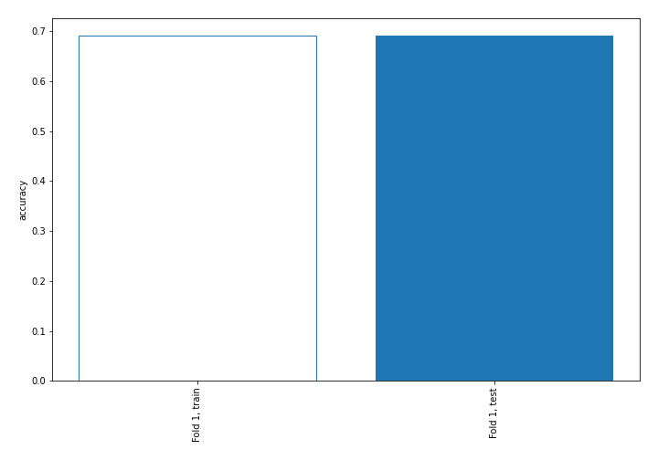

## Decision Tree 

### Tree #1
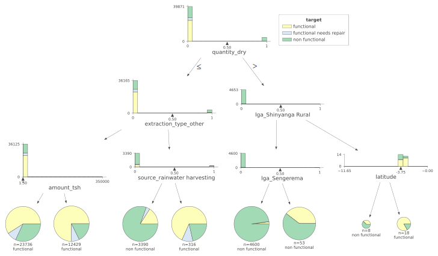

### Rules

if (quantity_dry <= 0.5) and (extraction_type_other <= 0.5) and (amount_tsh <= 1.5) then class: functional (proba: 59.13%) | based on 23,736 samples

if (quantity_dry <= 0.5) and (extraction_type_other <= 0.5) and (amount_tsh > 1.5) then class: functional (proba: 74.68%) | based on 12,429 samples

if (quantity_dry > 0.5) and (lga_Shinyanga Rural <= 0.5) and (lga_Sengerema <= 0.5) then class: non functional (proba: 97.72%) | based on 4,600 samples

if (quantity_dry <= 0.5) and (extraction_type_other > 0.5) and (source_rainwater harvesting <= 0.5) then class: non functional (proba: 80.53%) | based on 3,390 samples

if (quantity_dry <= 0.5) and (extraction_type_other > 0.5) and (source_rainwater harvesting > 0.5) then class: functional (proba: 68.35%) | based on 316 samples

if (quantity_dry > 0.5) and (lga_Shinyanga Rural <= 0.5) and (lga_Sengerema > 0.5) then class: non functional (proba: 60.38%) | based on 53 samples

if (quantity_dry > 0.5) and (lga_Shinyanga Rural > 0.5) and (latitude > -3.746) then class: functional (proba: 83.33%) | based on 18 samples

if (quantity_dry > 0.5) and (lga_Shinyanga Rural > 0.5) and (latitude <= -3.746) then class: non functional (proba: 62.5%) | based on 8 samples

## Permutation-based Importance
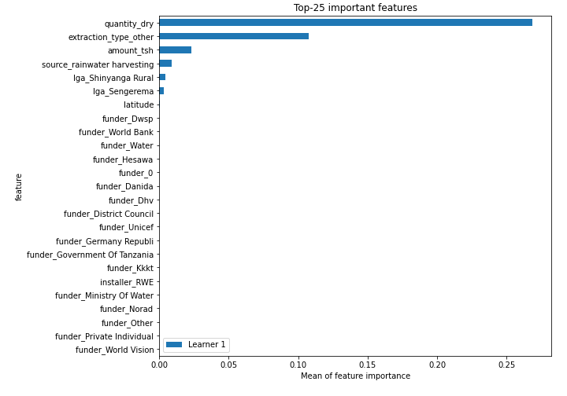
## Confusion Matrix

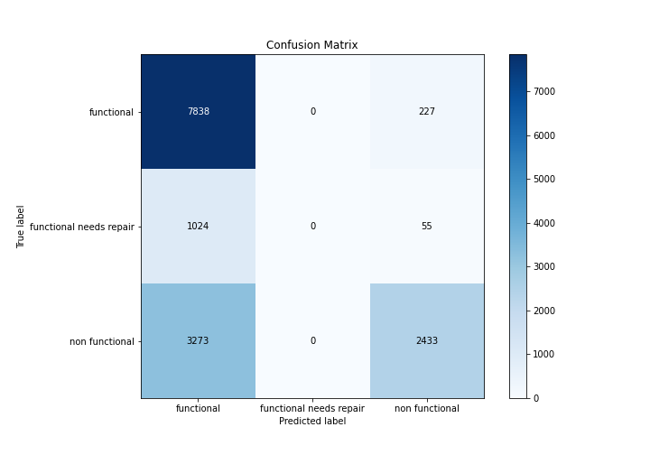

## Normalized Confusion Matrix

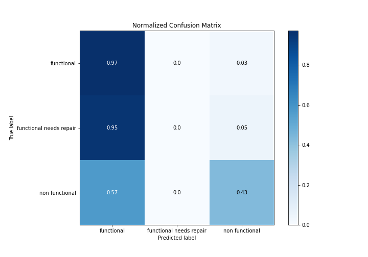

## ROC Curve

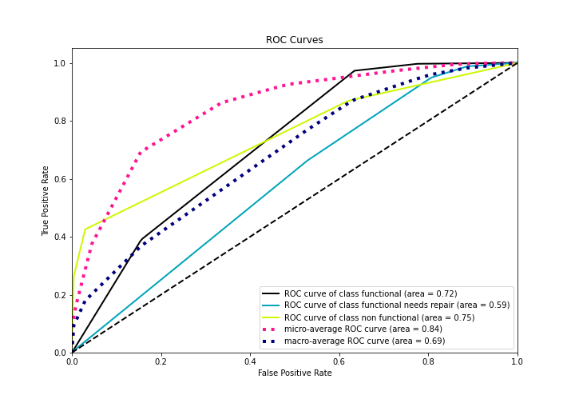

## Precision Recall Curve

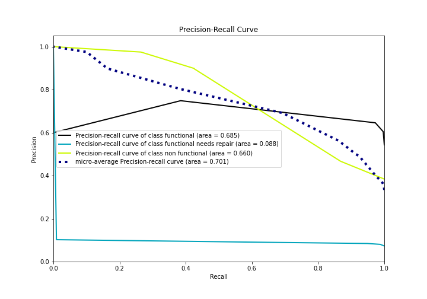

## SHAP Importance
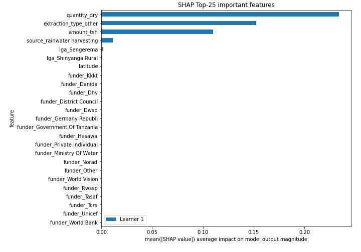

## SHAP Dependence plots

### Dependence functional (Fold 1)
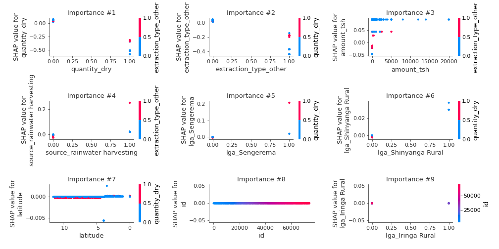
### Dependence functional needs repair (Fold 1)
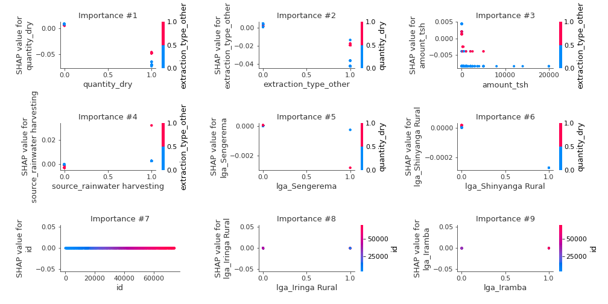
### Dependence non functional (Fold 1)
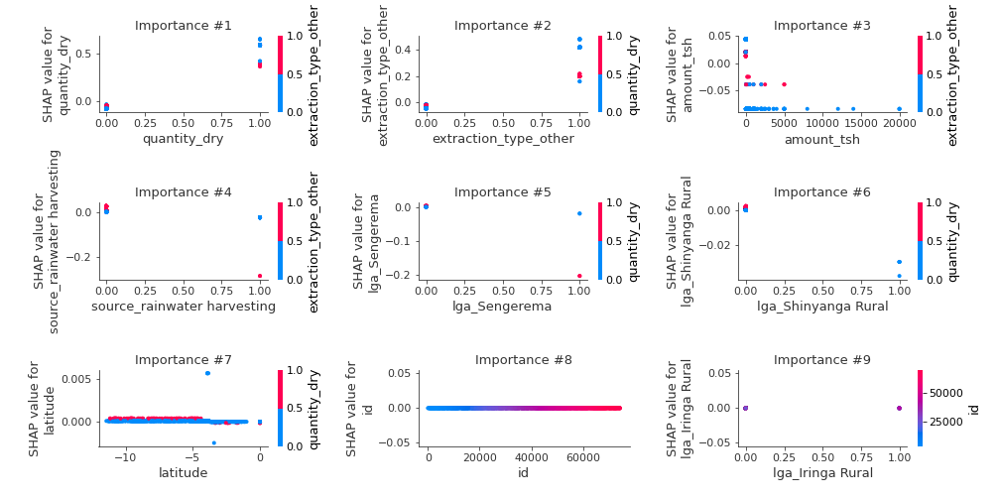

## SHAP Decision plots

### Worst decisions for selected sample 1 (Fold 1)

### Worst decisions for selected sample 2 (Fold 1)
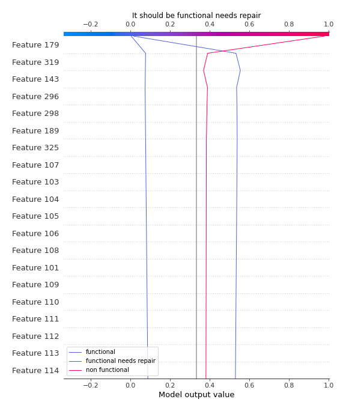
### Worst decisions for selected sample 3 (Fold 1)

### Worst decisions for selected sample 4 (Fold 1)
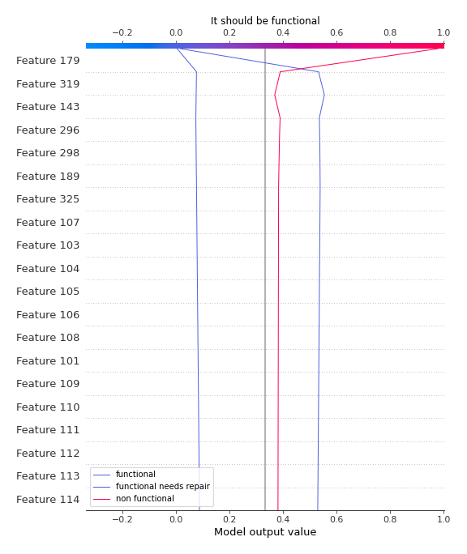
### Best decisions for selected sample 1 (Fold 1)

### Best decisions for selected sample 2 (Fold 1)

### Best decisions for selected sample 3 (Fold 1)
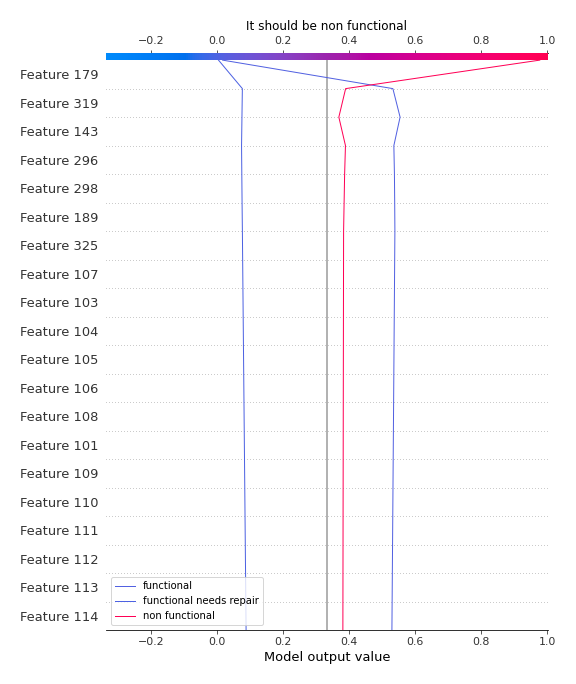
### Best decisions for selected sample 4 (Fold 1)

[<< Go back](../README.md)
