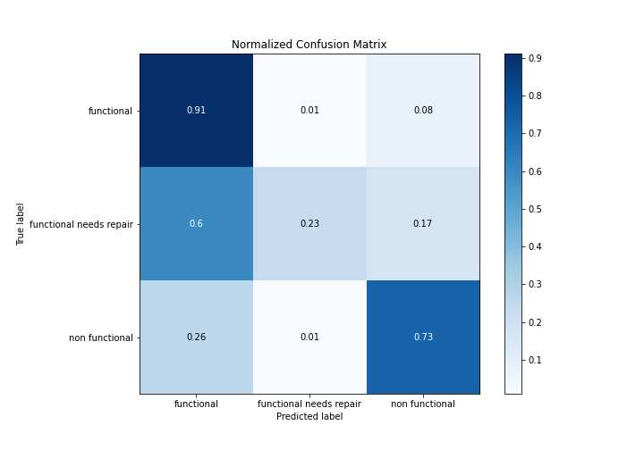

# Summary of 3_Default_Xgboost

[<< Go back](../README.md)

## Extreme Gradient Boosting (Xgboost)
- **n_jobs**: -1
- **objective**: multi:softprob
- **eta**: 0.075
- **max_depth**: 6
- **min_child_weight**: 1
- **subsample**: 1.0
- **colsample_bytree**: 1.0
- **eval_metric**: accuracy
- **num_class**: 3
- **explain_level**: 2

## Validation
 - **validation_type**: split
 - **train_ratio**: 0.75
 - **shuffle**: True
 - **stratify**: True

## Optimized metric
accuracy

## Training time

493.0 seconds

### Metric details
|           |   functional |   functional needs repair |   non functional |   accuracy |    macro avg |   weighted avg |   logloss |
|:----------|-------------:|--------------------------:|-----------------:|-----------:|-------------:|---------------:|----------:|
| precision |     0.774071 |                  0.616541 |         0.839531 |    0.79165 |     0.743381 |       0.787778 |  0.509915 |
| recall    |     0.912089 |                  0.227989 |         0.728006 |    0.79165 |     0.622695 |       0.79165  |  0.509915 |
| f1-score  |     0.837432 |                  0.332882 |         0.779801 |    0.79165 |     0.650038 |       0.778627 |  0.509915 |
| support   |  8065        |               1079        |      5706        |    0.79165 | 14850        |   14850        |  0.509915 |

## Confusion matrix
|                                    |   Predicted as functional |   Predicted as functional needs repair |   Predicted as non functional |
|:-----------------------------------|--------------------------:|---------------------------------------:|------------------------------:|
| Labeled as functional              |                      7356 |                                    103 |                           606 |
| Labeled as functional needs repair |                       645 |                                    246 |                           188 |
| Labeled as non functional          |                      1502 |                                     50 |                          4154 |

## Learning curves

## Permutation-based Importance

## Confusion Matrix

## Normalized Confusion Matrix

## ROC Curve

## Precision Recall Curve

## SHAP Importance

## SHAP Dependence plots

### Dependence functional (Fold 1)

### Dependence functional needs repair (Fold 1)

### Dependence non functional (Fold 1)

## SHAP Decision plots

### Worst decisions for selected sample 1 (Fold 1)

### Worst decisions for selected sample 2 (Fold 1)

### Worst decisions for selected sample 3 (Fold 1)

### Worst decisions for selected sample 4 (Fold 1)

### Best decisions for selected sample 1 (Fold 1)

### Best decisions for selected sample 2 (Fold 1)

### Best decisions for selected sample 3 (Fold 1)

### Best decisions for selected sample 4 (Fold 1)

[<< Go back](../README.md)
