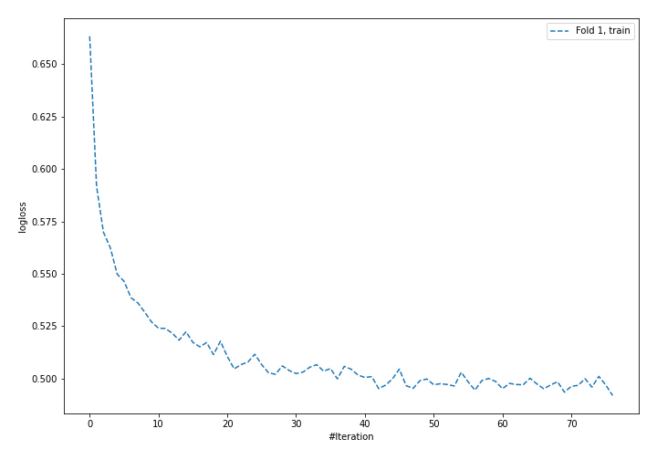
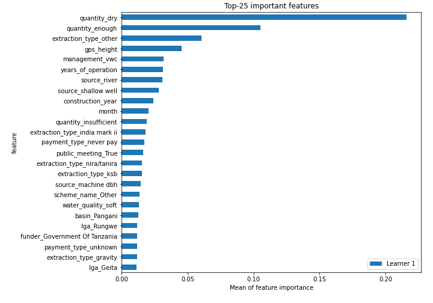
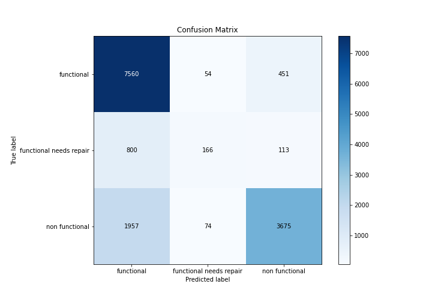
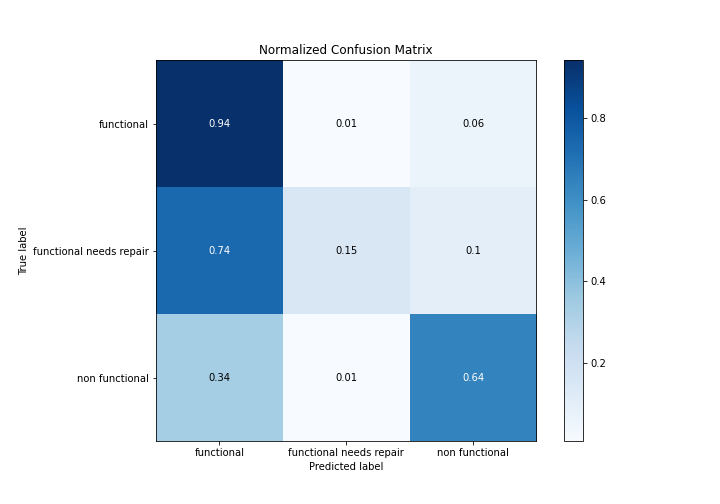
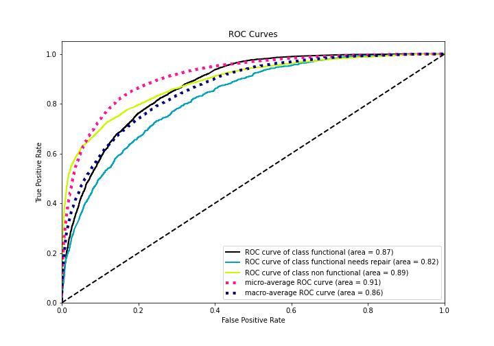
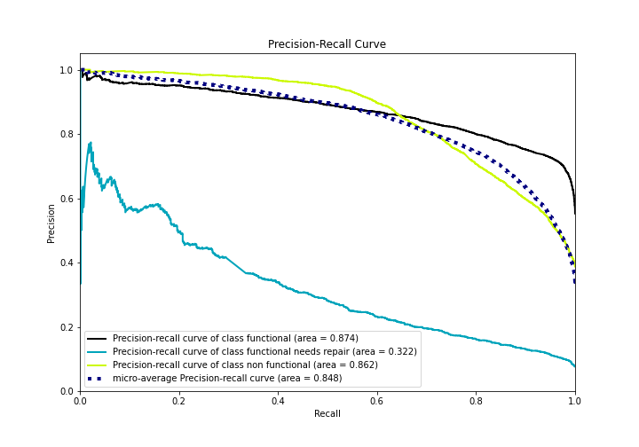

# Summary of 4_Default_NeuralNetwork

[<< Go back](../README.md)

## Neural Network
- **n_jobs**: -1
- **dense_1_size**: 32
- **dense_2_size**: 16
- **learning_rate**: 0.05
- **num_class**: 3
- **explain_level**: 2

## Validation
 - **validation_type**: split
 - **train_ratio**: 0.75
 - **shuffle**: True
 - **stratify**: True

## Optimized metric
accuracy

## Training time

68.7 seconds

### Metric details
|           |   functional |   functional needs repair |   non functional |   accuracy |    macro avg |   weighted avg |   logloss |
|:----------|-------------:|--------------------------:|-----------------:|-----------:|-------------:|---------------:|----------:|
| precision |     0.732771 |                  0.564626 |         0.86695  |   0.767744 |     0.721449 |       0.772111 |  0.618574 |
| recall    |     0.937384 |                  0.153846 |         0.644059 |   0.767744 |     0.57843  |       0.767744 |  0.618574 |
| f1-score  |     0.822544 |                  0.241806 |         0.739065 |   0.767744 |     0.601138 |       0.748271 |  0.618574 |
| support   |  8065        |               1079        |      5706        |   0.767744 | 14850        |   14850        |  0.618574 |

## Confusion matrix
|                                    |   Predicted as functional |   Predicted as functional needs repair |   Predicted as non functional |
|:-----------------------------------|--------------------------:|---------------------------------------:|------------------------------:|
| Labeled as functional              |                      7560 |                                     54 |                           451 |
| Labeled as functional needs repair |                       800 |                                    166 |                           113 |
| Labeled as non functional          |                      1957 |                                     74 |                          3675 |

## Learning curves

## Permutation-based Importance

## Confusion Matrix

## Normalized Confusion Matrix

## ROC Curve

## Precision Recall Curve

[<< Go back](../README.md)
