# Summary of 5_Default_RandomForest

[<< Go back](../README.md)

## Random Forest
- **n_jobs**: -1
- **criterion**: gini
- **max_features**: 0.9
- **min_samples_split**: 30
- **max_depth**: 4
- **eval_metric_name**: accuracy
- **num_class**: 3
- **explain_level**: 2

## Validation
 - **validation_type**: split
 - **train_ratio**: 0.75
 - **shuffle**: True
 - **stratify**: True

## Optimized metric
accuracy

## Training time

161.1 seconds

### Metric details
|           |   functional |   functional needs repair |   non functional |   accuracy |    macro avg |   weighted avg |   logloss |
|:----------|-------------:|--------------------------:|-----------------:|-----------:|-------------:|---------------:|----------:|
| precision |     0.669671 |                         0 |         0.84775  |   0.710707 |     0.505807 |       0.689438 |  0.712339 |
| recall    |     0.948915 |                         0 |         0.508412 |   0.710707 |     0.485776 |       0.710707 |  0.712339 |
| f1-score  |     0.785205 |                         0 |         0.635627 |   0.710707 |     0.473611 |       0.670678 |  0.712339 |
| support   |  8065        |                      1079 |      5706        |   0.710707 | 14850        |   14850        |  0.712339 |

## Confusion matrix
|                                    |   Predicted as functional |   Predicted as functional needs repair |   Predicted as non functional |
|:-----------------------------------|--------------------------:|---------------------------------------:|------------------------------:|
| Labeled as functional              |                      7653 |                                      0 |                           412 |
| Labeled as functional needs repair |                       970 |                                      0 |                           109 |
| Labeled as non functional          |                      2805 |                                      0 |                          2901 |

## Learning curves
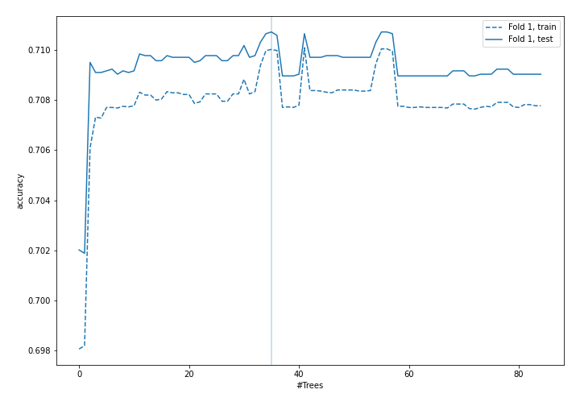

## Permutation-based Importance
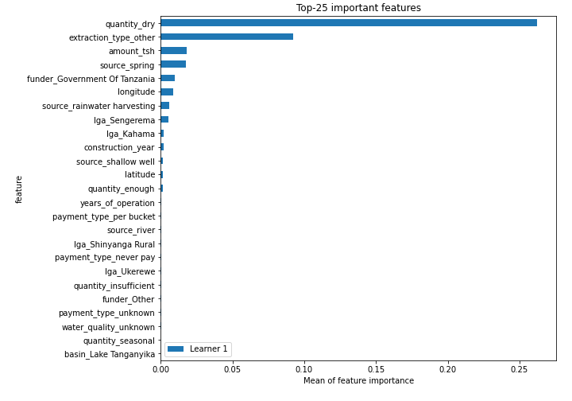
## Confusion Matrix

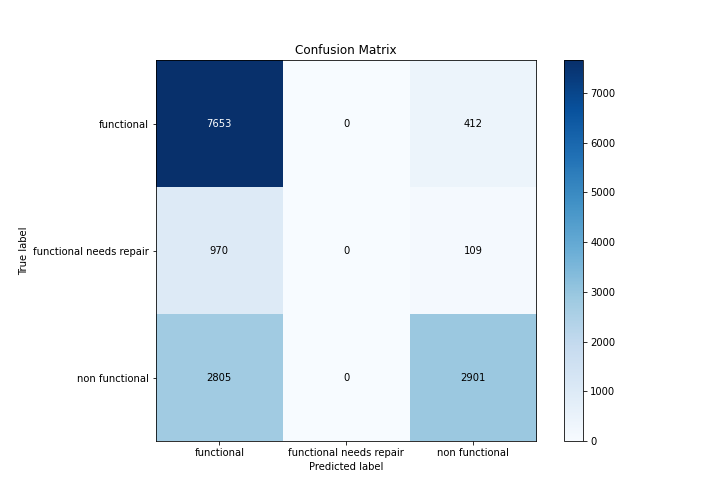

## Normalized Confusion Matrix

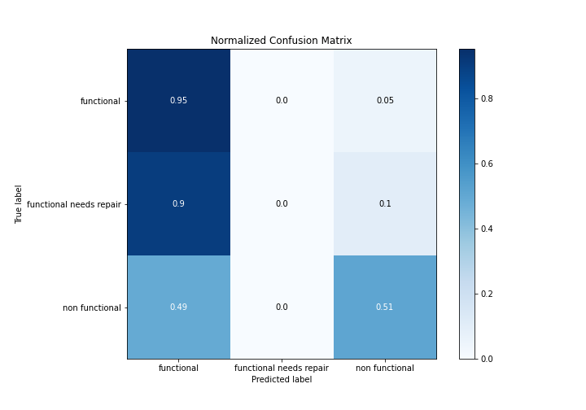

## ROC Curve

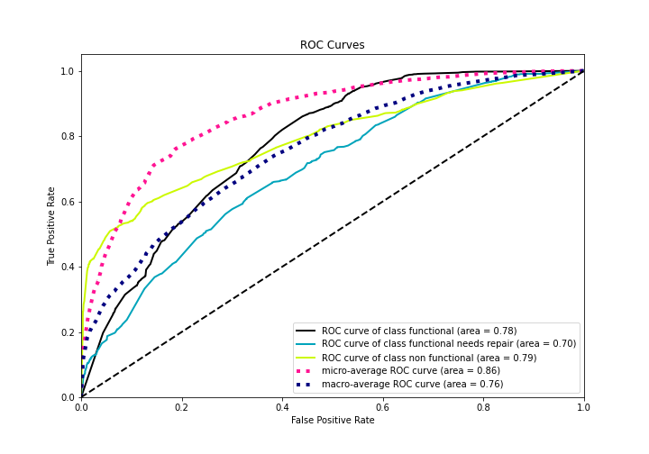

## Precision Recall Curve

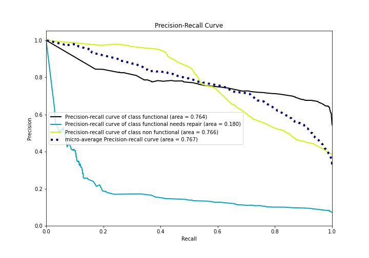

## SHAP Importance
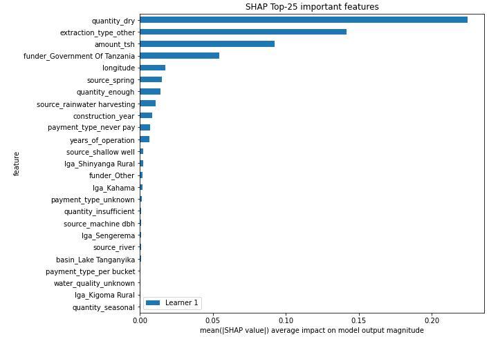

## SHAP Dependence plots

### Dependence functional (Fold 1)
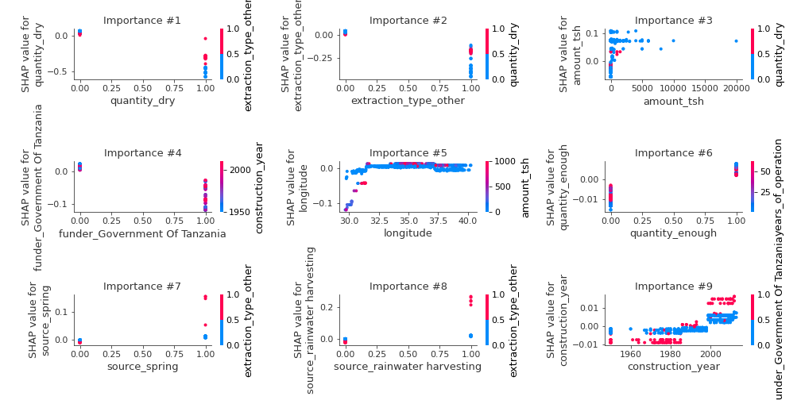
### Dependence functional needs repair (Fold 1)
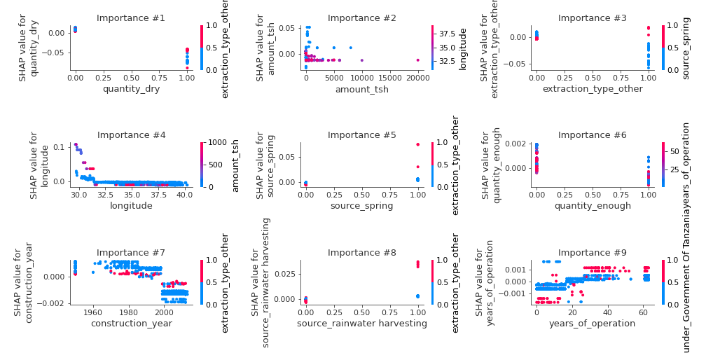
### Dependence non functional (Fold 1)
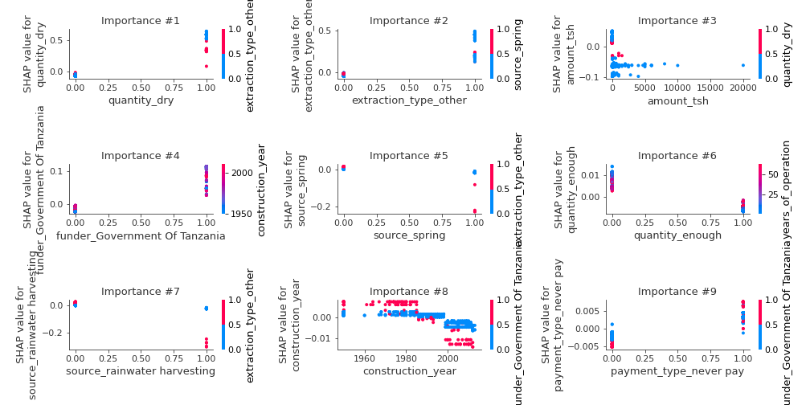

## SHAP Decision plots

### Worst decisions for selected sample 1 (Fold 1)
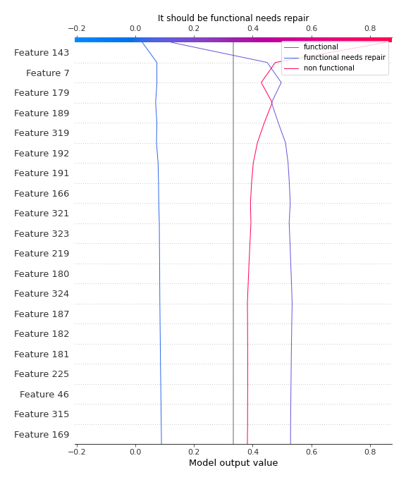
### Worst decisions for selected sample 2 (Fold 1)
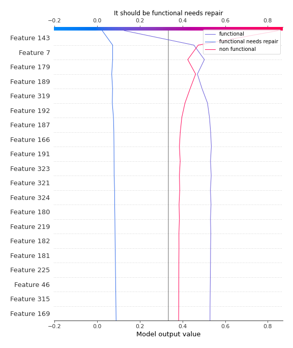
### Worst decisions for selected sample 3 (Fold 1)
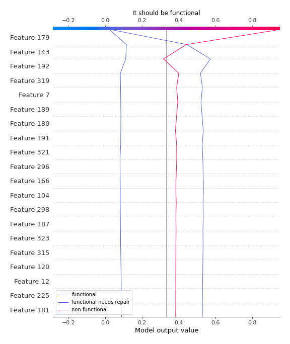
### Worst decisions for selected sample 4 (Fold 1)
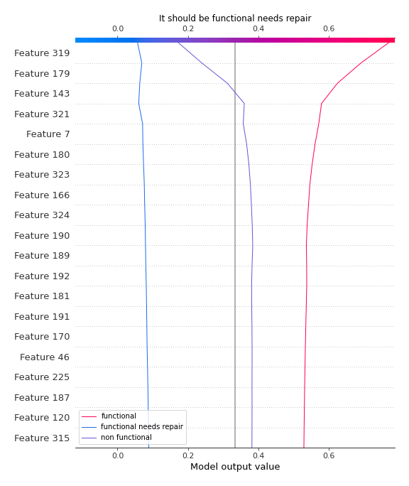
### Best decisions for selected sample 1 (Fold 1)

### Best decisions for selected sample 2 (Fold 1)
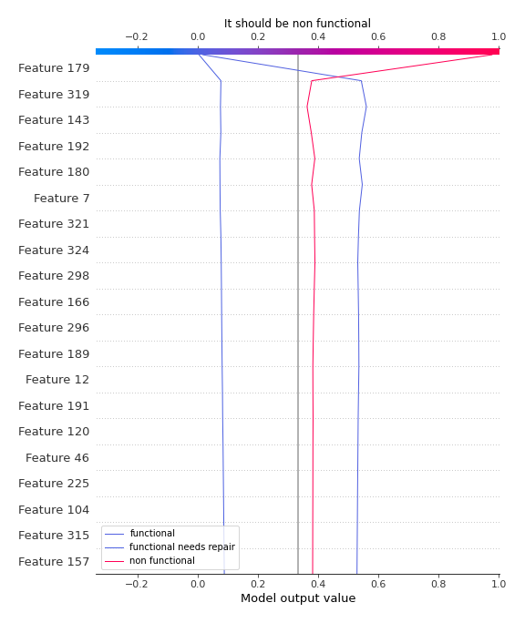
### Best decisions for selected sample 3 (Fold 1)

### Best decisions for selected sample 4 (Fold 1)
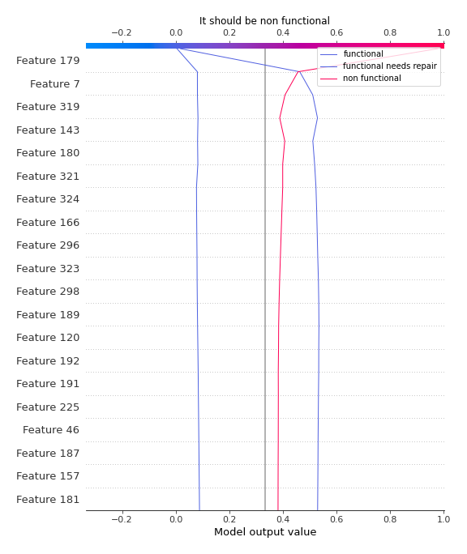

[<< Go back](../README.md)
