# Exploratory Data Analysis

[<< Go back](../README.md)
## Feature : target
- **Feature type** : categorical
- **Missing** : 0.0%
- **Unique** : 3
- **Count** :59400
- **Unique** :3
- **Top** :functional
- **Freq** :32259

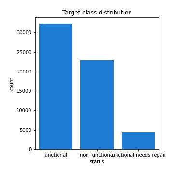
## Feature : id
- **Feature type** : discrete
- **Missing** : 0.0%
- **Unique** : 59400
- **Count** :59400.0
- **Mean** :37115.131767676765
- **Std** :21453.12837131775
- **Min** :0.0
- **25%th Percentile** : 18519.75
- **50%th Percentile** : 37061.5
- **75%th Percentile** : 55656.5
- **Max** :74247.0

## Feature : funder_0
- **Feature type** : discrete
- **Missing** : 0.0%
- **Unique** : 2
- **Count** :59400.0
- **Mean** :0.01308080808080808
- **Std** :0.11362181955701108
- **Min** :0.0
- **25%th Percentile** : 0.0
- **50%th Percentile** : 0.0
- **75%th Percentile** : 0.0
- **Max** :1.0

## Feature : funder_Danida
- **Feature type** : discrete
- **Missing** : 0.0%
- **Unique** : 2
- **Count** :59400.0
- **Mean** :0.05242424242424242
- **Std** :0.2228828785256348
- **Min** :0.0
- **25%th Percentile** : 0.0
- **50%th Percentile** : 0.0
- **75%th Percentile** : 0.0
- **Max** :1.0

## Feature : funder_Dhv
- **Feature type** : discrete
- **Missing** : 0.0%
- **Unique** : 2
- **Count** :59400.0
- **Mean** :0.013956228956228956
- **Std** :0.11731020547137946
- **Min** :0.0
- **25%th Percentile** : 0.0
- **50%th Percentile** : 0.0
- **75%th Percentile** : 0.0
- **Max** :1.0

## Feature : funder_District Council
- **Feature type** : discrete
- **Missing** : 0.0%
- **Unique** : 2
- **Count** :59400.0
- **Mean** :0.014191919191919191
- **Std** :0.1182824761153681
- **Min** :0.0
- **25%th Percentile** : 0.0
- **50%th Percentile** : 0.0
- **75%th Percentile** : 0.0
- **Max** :1.0

## Feature : funder_Dwsp
- **Feature type** : discrete
- **Missing** : 0.0%
- **Unique** : 2
- **Count** :59400.0
- **Mean** :0.013653198653198653
- **Std** :0.11604747105029146
- **Min** :0.0
- **25%th Percentile** : 0.0
- **50%th Percentile** : 0.0
- **75%th Percentile** : 0.0
- **Max** :1.0

## Feature : funder_Germany Republi
- **Feature type** : discrete
- **Missing** : 0.0%
- **Unique** : 2
- **Count** :59400.0
- **Mean** :0.01026936026936027
- **Std** :0.10081702049423605
- **Min** :0.0
- **25%th Percentile** : 0.0
- **50%th Percentile** : 0.0
- **75%th Percentile** : 0.0
- **Max** :1.0

## Feature : funder_Government Of Tanzania
- **Feature type** : discrete
- **Missing** : 0.0%
- **Unique** : 2
- **Count** :59400.0
- **Mean** :0.15292929292929294
- **Std** :0.35992235992034566
- **Min** :0.0
- **25%th Percentile** : 0.0
- **50%th Percentile** : 0.0
- **75%th Percentile** : 0.0
- **Max** :1.0

## Feature : funder_Hesawa
- **Feature type** : discrete
- **Missing** : 0.0%
- **Unique** : 2
- **Count** :59400.0
- **Mean** :0.037070707070707073
- **Std** :0.18893668439128286
- **Min** :0.0
- **25%th Percentile** : 0.0
- **50%th Percentile** : 0.0
- **75%th Percentile** : 0.0
- **Max** :1.0

## Feature : funder_Kkkt
- **Feature type** : discrete
- **Missing** : 0.0%
- **Unique** : 2
- **Count** :59400.0
- **Mean** :0.021666666666666667
- **Std** :0.14559388408797586
- **Min** :0.0
- **25%th Percentile** : 0.0
- **50%th Percentile** : 0.0
- **75%th Percentile** : 0.0
- **Max** :1.0

## Feature : funder_Ministry Of Water
- **Feature type** : discrete
- **Missing** : 0.0%
- **Unique** : 2
- **Count** :59400.0
- **Mean** :0.009932659932659932
- **Std** :0.09916737244528474
- **Min** :0.0
- **25%th Percentile** : 0.0
- **50%th Percentile** : 0.0
- **75%th Percentile** : 0.0
- **Max** :1.0

## Feature : funder_Norad
- **Feature type** : discrete
- **Missing** : 0.0%
- **Unique** : 2
- **Count** :59400.0
- **Mean** :0.012878787878787878
- **Std** :0.11275255530348553
- **Min** :0.0
- **25%th Percentile** : 0.0
- **50%th Percentile** : 0.0
- **75%th Percentile** : 0.0
- **Max** :1.0

## Feature : funder_Other
- **Feature type** : discrete
- **Missing** : 0.0%
- **Unique** : 2
- **Count** :59400.0
- **Mean** :0.45351851851851854
- **Std** :0.49783897429913165
- **Min** :0.0
- **25%th Percentile** : 0.0
- **50%th Percentile** : 0.0
- **75%th Percentile** : 1.0
- **Max** :1.0

## Feature : funder_Private Individual
- **Feature type** : discrete
- **Missing** : 0.0%
- **Unique** : 2
- **Count** :59400.0
- **Mean** :0.013905723905723906
- **Std** :0.11710074978406892
- **Min** :0.0
- **25%th Percentile** : 0.0
- **50%th Percentile** : 0.0
- **75%th Percentile** : 0.0
- **Max** :1.0

## Feature : funder_Rwssp
- **Feature type** : discrete
- **Missing** : 0.0%
- **Unique** : 2
- **Count** :59400.0
- **Mean** :0.02313131313131313
- **Std** :0.15032177453343226
- **Min** :0.0
- **25%th Percentile** : 0.0
- **50%th Percentile** : 0.0
- **75%th Percentile** : 0.0
- **Max** :1.0

## Feature : funder_Tasaf
- **Feature type** : discrete
- **Missing** : 0.0%
- **Unique** : 2
- **Count** :59400.0
- **Mean** :0.014764309764309765
- **Std** :0.12060916139846498
- **Min** :0.0
- **25%th Percentile** : 0.0
- **50%th Percentile** : 0.0
- **75%th Percentile** : 0.0
- **Max** :1.0

## Feature : funder_Tcrs
- **Feature type** : discrete
- **Missing** : 0.0%
- **Unique** : 2
- **Count** :59400.0
- **Mean** :0.010134680134680135
- **Std** :0.10016055752863963
- **Min** :0.0
- **25%th Percentile** : 0.0
- **50%th Percentile** : 0.0
- **75%th Percentile** : 0.0
- **Max** :1.0

## Feature : funder_Unicef
- **Feature type** : discrete
- **Missing** : 0.0%
- **Unique** : 2
- **Count** :59400.0
- **Mean** :0.017794612794612794
- **Std** :0.13220536599126256
- **Min** :0.0
- **25%th Percentile** : 0.0
- **50%th Percentile** : 0.0
- **75%th Percentile** : 0.0
- **Max** :1.0

## Feature : funder_Water
- **Feature type** : discrete
- **Missing** : 0.0%
- **Unique** : 2
- **Count** :59400.0
- **Mean** :0.009814814814814814
- **Std** :0.09858320261873055
- **Min** :0.0
- **25%th Percentile** : 0.0
- **50%th Percentile** : 0.0
- **75%th Percentile** : 0.0
- **Max** :1.0

## Feature : funder_World Bank
- **Feature type** : discrete
- **Missing** : 0.0%
- **Unique** : 2
- **Count** :59400.0
- **Mean** :0.022710437710437712
- **Std** :0.1489800234374877
- **Min** :0.0
- **25%th Percentile** : 0.0
- **50%th Percentile** : 0.0
- **75%th Percentile** : 0.0
- **Max** :1.0

## Feature : funder_World Vision
- **Feature type** : discrete
- **Missing** : 0.0%
- **Unique** : 2
- **Count** :59400.0
- **Mean** :0.020976430976430975
- **Std** :0.14330654575672497
- **Min** :0.0
- **25%th Percentile** : 0.0
- **50%th Percentile** : 0.0
- **75%th Percentile** : 0.0
- **Max** :1.0

## Feature : funder_no_data
- **Feature type** : discrete
- **Missing** : 0.0%
- **Unique** : 2
- **Count** :59400.0
- **Mean** :0.0611952861952862
- **Std** :0.2396901965827696
- **Min** :0.0
- **25%th Percentile** : 0.0
- **50%th Percentile** : 0.0
- **75%th Percentile** : 0.0
- **Max** :1.0

## Feature : installer_0
- **Feature type** : discrete
- **Missing** : 0.0%
- **Unique** : 2
- **Count** :59400.0
- **Mean** :0.01308080808080808
- **Std** :0.11362181955701108
- **Min** :0.0
- **25%th Percentile** : 0.0
- **50%th Percentile** : 0.0
- **75%th Percentile** : 0.0
- **Max** :1.0

## Feature : installer_CES
- **Feature type** : discrete
- **Missing** : 0.0%
- **Unique** : 2
- **Count** :59400.0
- **Mean** :0.01026936026936027
- **Std** :0.10081702049423605
- **Min** :0.0
- **25%th Percentile** : 0.0
- **50%th Percentile** : 0.0
- **75%th Percentile** : 0.0
- **Max** :1.0

## Feature : installer_Central government
- **Feature type** : discrete
- **Missing** : 0.0%
- **Unique** : 2
- **Count** :59400.0
- **Mean** :0.010471380471380472
- **Std** :0.1017934433313411
- **Min** :0.0
- **25%th Percentile** : 0.0
- **50%th Percentile** : 0.0
- **75%th Percentile** : 0.0
- **Max** :1.0

## Feature : installer_Commu
- **Feature type** : discrete
- **Missing** : 0.0%
- **Unique** : 2
- **Count** :59400.0
- **Mean** :0.017845117845117844
- **Std** :0.13238944323833818
- **Min** :0.0
- **25%th Percentile** : 0.0
- **50%th Percentile** : 0.0
- **75%th Percentile** : 0.0
- **Max** :1.0

## Feature : installer_Community
- **Feature type** : discrete
- **Missing** : 0.0%
- **Unique** : 2
- **Count** :59400.0
- **Mean** :0.00930976430976431
- **Std** :0.09603774191324026
- **Min** :0.0
- **25%th Percentile** : 0.0
- **50%th Percentile** : 0.0
- **75%th Percentile** : 0.0
- **Max** :1.0

## Feature : installer_DANID
- **Feature type** : discrete
- **Missing** : 0.0%
- **Unique** : 2
- **Count** :59400.0
- **Mean** :0.009292929292929294
- **Std** :0.09595168447436954
- **Min** :0.0
- **25%th Percentile** : 0.0
- **50%th Percentile** : 0.0
- **75%th Percentile** : 0.0
- **Max** :1.0

## Feature : installer_DANIDA
- **Feature type** : discrete
- **Missing** : 0.0%
- **Unique** : 2
- **Count** :59400.0
- **Mean** :0.017676767676767676
- **Std** :0.13177477715582045
- **Min** :0.0
- **25%th Percentile** : 0.0
- **50%th Percentile** : 0.0
- **75%th Percentile** : 0.0
- **Max** :1.0

## Feature : installer_DWE
- **Feature type** : discrete
- **Missing** : 0.0%
- **Unique** : 2
- **Count** :59400.0
- **Mean** :0.292962962962963
- **Std** :0.45512542500506803
- **Min** :0.0
- **25%th Percentile** : 0.0
- **50%th Percentile** : 0.0
- **75%th Percentile** : 1.0
- **Max** :1.0

## Feature : installer_District Council
- **Feature type** : discrete
- **Missing** : 0.0%
- **Unique** : 2
- **Count** :59400.0
- **Mean** :0.009276094276094276
- **Std** :0.09586554682626423
- **Min** :0.0
- **25%th Percentile** : 0.0
- **50%th Percentile** : 0.0
- **75%th Percentile** : 0.0
- **Max** :1.0

## Feature : installer_Government
- **Feature type** : discrete
- **Missing** : 0.0%
- **Unique** : 2
- **Count** :59400.0
- **Mean** :0.030723905723905723
- **Std** :0.17257012689144496
- **Min** :0.0
- **25%th Percentile** : 0.0
- **50%th Percentile** : 0.0
- **75%th Percentile** : 0.0
- **Max** :1.0

## Feature : installer_HESAWA
- **Feature type** : discrete
- **Missing** : 0.0%
- **Unique** : 2
- **Count** :59400.0
- **Mean** :0.009074074074074075
- **Std** :0.09482555896136399
- **Min** :0.0
- **25%th Percentile** : 0.0
- **50%th Percentile** : 0.0
- **75%th Percentile** : 0.0
- **Max** :1.0

## Feature : installer_Hesawa
- **Feature type** : discrete
- **Missing** : 0.0%
- **Unique** : 2
- **Count** :59400.0
- **Mean** :0.014141414141414142
- **Std** :0.11807484599071806
- **Min** :0.0
- **25%th Percentile** : 0.0
- **50%th Percentile** : 0.0
- **75%th Percentile** : 0.0
- **Max** :1.0

## Feature : installer_KKKT
- **Feature type** : discrete
- **Missing** : 0.0%
- **Unique** : 2
- **Count** :59400.0
- **Mean** :0.015117845117845119
- **Std** :0.12202272961462823
- **Min** :0.0
- **25%th Percentile** : 0.0
- **50%th Percentile** : 0.0
- **75%th Percentile** : 0.0
- **Max** :1.0

## Feature : installer_LGA
- **Feature type** : discrete
- **Missing** : 0.0%
- **Unique** : 2
- **Count** :59400.0
- **Mean** :0.006868686868686869
- **Std** :0.08259311624779841
- **Min** :0.0
- **25%th Percentile** : 0.0
- **50%th Percentile** : 0.0
- **75%th Percentile** : 0.0
- **Max** :1.0

## Feature : installer_Other
- **Feature type** : discrete
- **Missing** : 0.0%
- **Unique** : 2
- **Count** :59400.0
- **Mean** :0.41993265993265994
- **Std** :0.49355174191994994
- **Min** :0.0
- **25%th Percentile** : 0.0
- **50%th Percentile** : 0.0
- **75%th Percentile** : 1.0
- **Max** :1.0

## Feature : installer_RWE
- **Feature type** : discrete
- **Missing** : 0.0%
- **Unique** : 2
- **Count** :59400.0
- **Mean** :0.020303030303030302
- **Std** :0.1410359958713574
- **Min** :0.0
- **25%th Percentile** : 0.0
- **50%th Percentile** : 0.0
- **75%th Percentile** : 0.0
- **Max** :1.0

## Feature : installer_TASAF
- **Feature type** : discrete
- **Missing** : 0.0%
- **Unique** : 2
- **Count** :59400.0
- **Mean** :0.006666666666666667
- **Std** :0.08137772243877131
- **Min** :0.0
- **25%th Percentile** : 0.0
- **50%th Percentile** : 0.0
- **75%th Percentile** : 0.0
- **Max** :1.0

## Feature : installer_TCRS
- **Feature type** : discrete
- **Missing** : 0.0%
- **Unique** : 2
- **Count** :59400.0
- **Mean** :0.011902356902356902
- **Std** :0.1084476315891072
- **Min** :0.0
- **25%th Percentile** : 0.0
- **50%th Percentile** : 0.0
- **75%th Percentile** : 0.0
- **Max** :1.0

## Feature : installer_WEDECO
- **Feature type** : discrete
- **Missing** : 0.0%
- **Unique** : 2
- **Count** :59400.0
- **Mean** :0.006683501683501684
- **Std** :0.08147971683484559
- **Min** :0.0
- **25%th Percentile** : 0.0
- **50%th Percentile** : 0.0
- **75%th Percentile** : 0.0
- **Max** :1.0

## Feature : installer_World vision
- **Feature type** : discrete
- **Missing** : 0.0%
- **Unique** : 2
- **Count** :59400.0
- **Mean** :0.006868686868686869
- **Std** :0.08259311624779841
- **Min** :0.0
- **25%th Percentile** : 0.0
- **50%th Percentile** : 0.0
- **75%th Percentile** : 0.0
- **Max** :1.0

## Feature : installer_no_data
- **Feature type** : discrete
- **Missing** : 0.0%
- **Unique** : 2
- **Count** :59400.0
- **Mean** :0.061531986531986535
- **Std** :0.24030558323375512
- **Min** :0.0
- **25%th Percentile** : 0.0
- **50%th Percentile** : 0.0
- **75%th Percentile** : 0.0
- **Max** :1.0

## Feature : basin_Internal
- **Feature type** : discrete
- **Missing** : 0.0%
- **Unique** : 2
- **Count** :59400.0
- **Mean** :0.13106060606060607
- **Std** :0.3374694665689237
- **Min** :0.0
- **25%th Percentile** : 0.0
- **50%th Percentile** : 0.0
- **75%th Percentile** : 0.0
- **Max** :1.0

## Feature : basin_Lake Nyasa
- **Feature type** : discrete
- **Missing** : 0.0%
- **Unique** : 2
- **Count** :59400.0
- **Mean** :0.0856060606060606
- **Std** :0.27978381086390974
- **Min** :0.0
- **25%th Percentile** : 0.0
- **50%th Percentile** : 0.0
- **75%th Percentile** : 0.0
- **Max** :1.0

## Feature : basin_Lake Rukwa
- **Feature type** : discrete
- **Missing** : 0.0%
- **Unique** : 2
- **Count** :59400.0
- **Mean** :0.041313131313131315
- **Std** :0.19901513329176496
- **Min** :0.0
- **25%th Percentile** : 0.0
- **50%th Percentile** : 0.0
- **75%th Percentile** : 0.0
- **Max** :1.0

## Feature : basin_Lake Tanganyika
- **Feature type** : discrete
- **Missing** : 0.0%
- **Unique** : 2
- **Count** :59400.0
- **Mean** :0.10828282828282829
- **Std** :0.3107398959886773
- **Min** :0.0
- **25%th Percentile** : 0.0
- **50%th Percentile** : 0.0
- **75%th Percentile** : 0.0
- **Max** :1.0

## Feature : basin_Lake Victoria
- **Feature type** : discrete
- **Missing** : 0.0%
- **Unique** : 2
- **Count** :59400.0
- **Mean** :0.17252525252525253
- **Std** :0.3778395071702977
- **Min** :0.0
- **25%th Percentile** : 0.0
- **50%th Percentile** : 0.0
- **75%th Percentile** : 0.0
- **Max** :1.0

## Feature : basin_Pangani
- **Feature type** : discrete
- **Missing** : 0.0%
- **Unique** : 2
- **Count** :59400.0
- **Mean** :0.1505050505050505
- **Std** :0.3575687804127831
- **Min** :0.0
- **25%th Percentile** : 0.0
- **50%th Percentile** : 0.0
- **75%th Percentile** : 0.0
- **Max** :1.0

## Feature : basin_Rufiji
- **Feature type** : discrete
- **Missing** : 0.0%
- **Unique** : 2
- **Count** :59400.0
- **Mean** :0.13427609427609427
- **Std** :0.34095158280726995
- **Min** :0.0
- **25%th Percentile** : 0.0
- **50%th Percentile** : 0.0
- **75%th Percentile** : 0.0
- **Max** :1.0

## Feature : basin_Ruvuma / Southern Coast
- **Feature type** : discrete
- **Missing** : 0.0%
- **Unique** : 2
- **Count** :59400.0
- **Mean** :0.07563973063973065
- **Std** :0.26442303017152996
- **Min** :0.0
- **25%th Percentile** : 0.0
- **50%th Percentile** : 0.0
- **75%th Percentile** : 0.0
- **Max** :1.0

## Feature : basin_Wami / Ruvu
- **Feature type** : discrete
- **Missing** : 0.0%
- **Unique** : 2
- **Count** :59400.0
- **Mean** :0.10079124579124579
- **Std** :0.3010546402005223
- **Min** :0.0
- **25%th Percentile** : 0.0
- **50%th Percentile** : 0.0
- **75%th Percentile** : 0.0
- **Max** :1.0

## Feature : subvillage_1
- **Feature type** : discrete
- **Missing** : 0.0%
- **Unique** : 2
- **Count** :59400.0
- **Mean** :0.0022222222222222222
- **Std** :0.04708844103661056
- **Min** :0.0
- **25%th Percentile** : 0.0
- **50%th Percentile** : 0.0
- **75%th Percentile** : 0.0
- **Max** :1.0

## Feature : subvillage_Kanisani
- **Feature type** : discrete
- **Missing** : 0.0%
- **Unique** : 2
- **Count** :59400.0
- **Mean** :0.0018686868686868688
- **Std** :0.04318826552652326
- **Min** :0.0
- **25%th Percentile** : 0.0
- **50%th Percentile** : 0.0
- **75%th Percentile** : 0.0
- **Max** :1.0

## Feature : subvillage_Kati
- **Feature type** : discrete
- **Missing** : 0.0%
- **Unique** : 2
- **Count** :59400.0
- **Mean** :0.00627946127946128
- **Std** :0.07899452321695298
- **Min** :0.0
- **25%th Percentile** : 0.0
- **50%th Percentile** : 0.0
- **75%th Percentile** : 0.0
- **Max** :1.0

## Feature : subvillage_Kibaoni
- **Feature type** : discrete
- **Missing** : 0.0%
- **Unique** : 2
- **Count** :59400.0
- **Mean** :0.0019191919191919192
- **Std** :0.04376689239290377
- **Min** :0.0
- **25%th Percentile** : 0.0
- **50%th Percentile** : 0.0
- **75%th Percentile** : 0.0
- **Max** :1.0

## Feature : subvillage_M
- **Feature type** : discrete
- **Missing** : 0.0%
- **Unique** : 2
- **Count** :59400.0
- **Mean** :0.003148148148148148
- **Std** :0.056020443987466556
- **Min** :0.0
- **25%th Percentile** : 0.0
- **50%th Percentile** : 0.0
- **75%th Percentile** : 0.0
- **Max** :1.0

## Feature : subvillage_Madukani
- **Feature type** : discrete
- **Missing** : 0.0%
- **Unique** : 2
- **Count** :59400.0
- **Mean** :0.008552188552188552
- **Std** :0.09208252478340198
- **Min** :0.0
- **25%th Percentile** : 0.0
- **50%th Percentile** : 0.0
- **75%th Percentile** : 0.0
- **Max** :1.0

## Feature : subvillage_Majengo
- **Feature type** : discrete
- **Missing** : 0.0%
- **Unique** : 2
- **Count** :59400.0
- **Mean** :0.00845117845117845
- **Std** :0.09154177794686809
- **Min** :0.0
- **25%th Percentile** : 0.0
- **50%th Percentile** : 0.0
- **75%th Percentile** : 0.0
- **Max** :1.0

## Feature : subvillage_Mapinduzi
- **Feature type** : discrete
- **Missing** : 0.0%
- **Unique** : 2
- **Count** :59400.0
- **Mean** :0.001835016835016835
- **Std** :0.04279813529351661
- **Min** :0.0
- **25%th Percentile** : 0.0
- **50%th Percentile** : 0.0
- **75%th Percentile** : 0.0
- **Max** :1.0

## Feature : subvillage_Mbuyuni
- **Feature type** : discrete
- **Missing** : 0.0%
- **Unique** : 2
- **Count** :59400.0
- **Mean** :0.002760942760942761
- **Std** :0.05247252908886442
- **Min** :0.0
- **25%th Percentile** : 0.0
- **50%th Percentile** : 0.0
- **75%th Percentile** : 0.0
- **Max** :1.0

## Feature : subvillage_Miembeni
- **Feature type** : discrete
- **Missing** : 0.0%
- **Unique** : 2
- **Count** :59400.0
- **Mean** :0.002255892255892256
- **Std** :0.04744303003571604
- **Min** :0.0
- **25%th Percentile** : 0.0
- **50%th Percentile** : 0.0
- **75%th Percentile** : 0.0
- **Max** :1.0

## Feature : subvillage_Mjimwema
- **Feature type** : discrete
- **Missing** : 0.0%
- **Unique** : 2
- **Count** :59400.0
- **Mean** :0.0018181818181818182
- **Std** :0.04260172047043169
- **Min** :0.0
- **25%th Percentile** : 0.0
- **50%th Percentile** : 0.0
- **75%th Percentile** : 0.0
- **Max** :1.0

## Feature : subvillage_Mjini
- **Feature type** : discrete
- **Missing** : 0.0%
- **Unique** : 2
- **Count** :59400.0
- **Mean** :0.0018181818181818182
- **Std** :0.04260172047043169
- **Min** :0.0
- **25%th Percentile** : 0.0
- **50%th Percentile** : 0.0
- **75%th Percentile** : 0.0
- **Max** :1.0

## Feature : subvillage_Mlimani
- **Feature type** : discrete
- **Missing** : 0.0%
- **Unique** : 2
- **Count** :59400.0
- **Mean** :0.0025589225589225588
- **Std** :0.05052145528634979
- **Min** :0.0
- **25%th Percentile** : 0.0
- **50%th Percentile** : 0.0
- **75%th Percentile** : 0.0
- **Max** :1.0

## Feature : subvillage_Msikitini
- **Feature type** : discrete
- **Missing** : 0.0%
- **Unique** : 2
- **Count** :59400.0
- **Mean** :0.002255892255892256
- **Std** :0.047443030035716045
- **Min** :0.0
- **25%th Percentile** : 0.0
- **50%th Percentile** : 0.0
- **75%th Percentile** : 0.0
- **Max** :1.0

## Feature : subvillage_Mtakuja
- **Feature type** : discrete
- **Missing** : 0.0%
- **Unique** : 2
- **Count** :59400.0
- **Mean** :0.004410774410774411
- **Std** :0.06626758943143804
- **Min** :0.0
- **25%th Percentile** : 0.0
- **50%th Percentile** : 0.0
- **75%th Percentile** : 0.0
- **Max** :1.0

## Feature : subvillage_Muungano
- **Feature type** : discrete
- **Missing** : 0.0%
- **Unique** : 2
- **Count** :59400.0
- **Mean** :0.0028956228956228958
- **Std** :0.053733479984012976
- **Min** :0.0
- **25%th Percentile** : 0.0
- **50%th Percentile** : 0.0
- **75%th Percentile** : 0.0
- **Max** :1.0

## Feature : subvillage_Other
- **Feature type** : discrete
- **Missing** : 0.0%
- **Unique** : 2
- **Count** :59400.0
- **Mean** :0.9238047138047139
- **Std** :0.26531255075167276
- **Min** :0.0
- **25%th Percentile** : 1.0
- **50%th Percentile** : 1.0
- **75%th Percentile** : 1.0
- **Max** :1.0

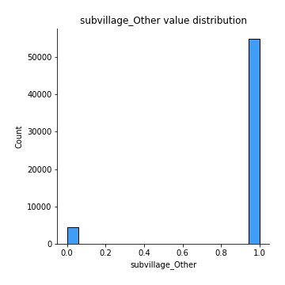
## Feature : subvillage_Shuleni
- **Feature type** : discrete
- **Missing** : 0.0%
- **Unique** : 2
- **Count** :59400.0
- **Mean** :0.008518518518518519
- **Std** :0.09190264169722744
- **Min** :0.0
- **25%th Percentile** : 0.0
- **50%th Percentile** : 0.0
- **75%th Percentile** : 0.0
- **Max** :1.0

## Feature : subvillage_Sokoni
- **Feature type** : discrete
- **Missing** : 0.0%
- **Unique** : 2
- **Count** :59400.0
- **Mean** :0.003905723905723906
- **Std** :0.06237415108611686
- **Min** :0.0
- **25%th Percentile** : 0.0
- **50%th Percentile** : 0.0
- **75%th Percentile** : 0.0
- **Max** :1.0

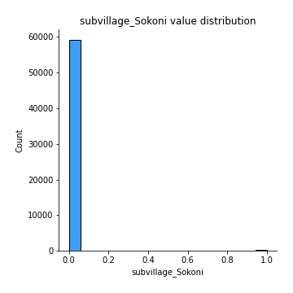
## Feature : subvillage_Songambele
- **Feature type** : discrete
- **Missing** : 0.0%
- **Unique** : 2
- **Count** :59400.0
- **Mean** :0.0024747474747474746
- **Std** :0.049685658491105976
- **Min** :0.0
- **25%th Percentile** : 0.0
- **50%th Percentile** : 0.0
- **75%th Percentile** : 0.0
- **Max** :1.0

## Feature : subvillage_no_data
- **Feature type** : discrete
- **Missing** : 0.0%
- **Unique** : 2
- **Count** :59400.0
- **Mean** :0.0062457912457912455
- **Std** :0.07878379167400293
- **Min** :0.0
- **25%th Percentile** : 0.0
- **50%th Percentile** : 0.0
- **75%th Percentile** : 0.0
- **Max** :1.0

## Feature : ward_Chalinze
- **Feature type** : discrete
- **Missing** : 0.0%
- **Unique** : 2
- **Count** :59400.0
- **Mean** :0.0032996632996633
- **Std** :0.05734832943770502
- **Min** :0.0
- **25%th Percentile** : 0.0
- **50%th Percentile** : 0.0
- **75%th Percentile** : 0.0
- **Max** :1.0

## Feature : ward_Chanika
- **Feature type** : discrete
- **Missing** : 0.0%
- **Unique** : 2
- **Count** :59400.0
- **Mean** :0.0028787878787878787
- **Std** :0.05357750260019538
- **Min** :0.0
- **25%th Percentile** : 0.0
- **50%th Percentile** : 0.0
- **75%th Percentile** : 0.0
- **Max** :1.0

## Feature : ward_Igosi
- **Feature type** : discrete
- **Missing** : 0.0%
- **Unique** : 2
- **Count** :59400.0
- **Mean** :0.005168350168350168
- **Std** :0.07170582184113435
- **Min** :0.0
- **25%th Percentile** : 0.0
- **50%th Percentile** : 0.0
- **75%th Percentile** : 0.0
- **Max** :1.0

## Feature : ward_Imalinyi
- **Feature type** : discrete
- **Missing** : 0.0%
- **Unique** : 2
- **Count** :59400.0
- **Mean** :0.004242424242424243
- **Std** :0.0649961321807151
- **Min** :0.0
- **25%th Percentile** : 0.0
- **50%th Percentile** : 0.0
- **75%th Percentile** : 0.0
- **Max** :1.0

## Feature : ward_Itete
- **Feature type** : discrete
- **Missing** : 0.0%
- **Unique** : 2
- **Count** :59400.0
- **Mean** :0.0023063973063973064
- **Std** :0.04796995494263745
- **Min** :0.0
- **25%th Percentile** : 0.0
- **50%th Percentile** : 0.0
- **75%th Percentile** : 0.0
- **Max** :1.0

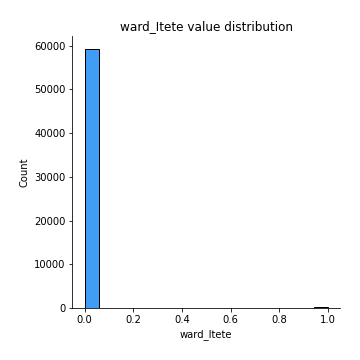
## Feature : ward_Kitunda
- **Feature type** : discrete
- **Missing** : 0.0%
- **Unique** : 2
- **Count** :59400.0
- **Mean** :0.0034175084175084177
- **Std** :0.058359972514382
- **Min** :0.0
- **25%th Percentile** : 0.0
- **50%th Percentile** : 0.0
- **75%th Percentile** : 0.0
- **Max** :1.0

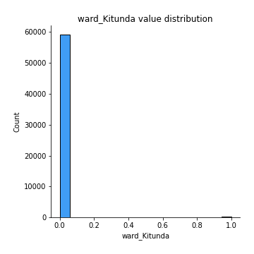
## Feature : ward_Magomeni
- **Feature type** : discrete
- **Missing** : 0.0%
- **Unique** : 2
- **Count** :59400.0
- **Mean** :0.0022727272727272726
- **Std** :0.04761932547357132
- **Min** :0.0
- **25%th Percentile** : 0.0
- **50%th Percentile** : 0.0
- **75%th Percentile** : 0.0
- **Max** :1.0

## Feature : ward_Maji ya Chai
- **Feature type** : discrete
- **Missing** : 0.0%
- **Unique** : 2
- **Count** :59400.0
- **Mean** :0.0031986531986531986
- **Std** :0.05646658741598053
- **Min** :0.0
- **25%th Percentile** : 0.0
- **50%th Percentile** : 0.0
- **75%th Percentile** : 0.0
- **Max** :1.0

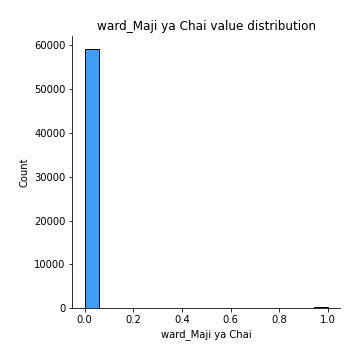
## Feature : ward_Maramba
- **Feature type** : discrete
- **Missing** : 0.0%
- **Unique** : 2
- **Count** :59400.0
- **Mean** :0.00234006734006734
- **Std** :0.04831801660311512
- **Min** :0.0
- **25%th Percentile** : 0.0
- **50%th Percentile** : 0.0
- **75%th Percentile** : 0.0
- **Max** :1.0

## Feature : ward_Matola
- **Feature type** : discrete
- **Missing** : 0.0%
- **Unique** : 2
- **Count** :59400.0
- **Mean** :0.002441077441077441
- **Std** :0.04934733607761004
- **Min** :0.0
- **25%th Percentile** : 0.0
- **50%th Percentile** : 0.0
- **75%th Percentile** : 0.0
- **Max** :1.0

## Feature : ward_Mdandu
- **Feature type** : discrete
- **Missing** : 0.0%
- **Unique** : 2
- **Count** :59400.0
- **Mean** :0.0038888888888888888
- **Std** :0.062240104820790114
- **Min** :0.0
- **25%th Percentile** : 0.0
- **50%th Percentile** : 0.0
- **75%th Percentile** : 0.0
- **Max** :1.0

## Feature : ward_Mishamo
- **Feature type** : discrete
- **Missing** : 0.0%
- **Unique** : 2
- **Count** :59400.0
- **Mean** :0.0034175084175084177
- **Std** :0.058359972514382005
- **Min** :0.0
- **25%th Percentile** : 0.0
- **50%th Percentile** : 0.0
- **75%th Percentile** : 0.0
- **Max** :1.0

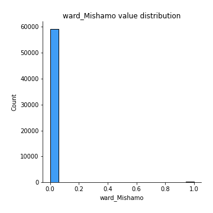
## Feature : ward_Msindo
- **Feature type** : discrete
- **Missing** : 0.0%
- **Unique** : 2
- **Count** :59400.0
- **Mean** :0.003383838383838384
- **Std** :0.05807275434138952
- **Min** :0.0
- **25%th Percentile** : 0.0
- **50%th Percentile** : 0.0
- **75%th Percentile** : 0.0
- **Max** :1.0

## Feature : ward_Mtwango
- **Feature type** : discrete
- **Missing** : 0.0%
- **Unique** : 2
- **Count** :59400.0
- **Mean** :0.002575757575757576
- **Std** :0.05068694408451179
- **Min** :0.0
- **25%th Percentile** : 0.0
- **50%th Percentile** : 0.0
- **75%th Percentile** : 0.0
- **Max** :1.0

## Feature : ward_Nduruma
- **Feature type** : discrete
- **Missing** : 0.0%
- **Unique** : 2
- **Count** :59400.0
- **Mean** :0.003653198653198653
- **Std** :0.060331700380592455
- **Min** :0.0
- **25%th Percentile** : 0.0
- **50%th Percentile** : 0.0
- **75%th Percentile** : 0.0
- **Max** :1.0

## Feature : ward_Ngarenanyuki
- **Feature type** : discrete
- **Missing** : 0.0%
- **Unique** : 2
- **Count** :59400.0
- **Mean** :0.0028956228956228958
- **Std** :0.053733479984012976
- **Min** :0.0
- **25%th Percentile** : 0.0
- **50%th Percentile** : 0.0
- **75%th Percentile** : 0.0
- **Max** :1.0

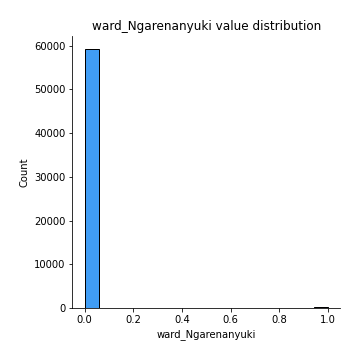
## Feature : ward_Other
- **Feature type** : discrete
- **Missing** : 0.0%
- **Unique** : 2
- **Count** :59400.0
- **Mean** :0.9364646464646464
- **Std** :0.2439254272590203
- **Min** :0.0
- **25%th Percentile** : 1.0
- **50%th Percentile** : 1.0
- **75%th Percentile** : 1.0
- **Max** :1.0

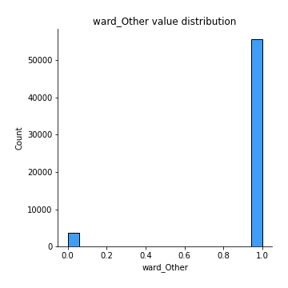
## Feature : ward_Siha Kati
- **Feature type** : discrete
- **Missing** : 0.0%
- **Unique** : 2
- **Count** :59400.0
- **Mean** :0.003905723905723906
- **Std** :0.06237415108611685
- **Min** :0.0
- **25%th Percentile** : 0.0
- **50%th Percentile** : 0.0
- **75%th Percentile** : 0.0
- **Max** :1.0

## Feature : ward_Usuka
- **Feature type** : discrete
- **Missing** : 0.0%
- **Unique** : 2
- **Count** :59400.0
- **Mean** :0.003148148148148148
- **Std** :0.056020443987466556
- **Min** :0.0
- **25%th Percentile** : 0.0
- **50%th Percentile** : 0.0
- **75%th Percentile** : 0.0
- **Max** :1.0

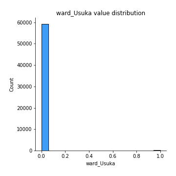
## Feature : ward_Vikindu
- **Feature type** : discrete
- **Missing** : 0.0%
- **Unique** : 2
- **Count** :59400.0
- **Mean** :0.0027272727272727275
- **Std** :0.05215247357487283
- **Min** :0.0
- **25%th Percentile** : 0.0
- **50%th Percentile** : 0.0
- **75%th Percentile** : 0.0
- **Max** :1.0

## Feature : ward_Zinga/Ikerege
- **Feature type** : discrete
- **Missing** : 0.0%
- **Unique** : 2
- **Count** :59400.0
- **Mean** :0.002373737373737374
- **Std** :0.048663565553077215
- **Min** :0.0
- **25%th Percentile** : 0.0
- **50%th Percentile** : 0.0
- **75%th Percentile** : 0.0
- **Max** :1.0

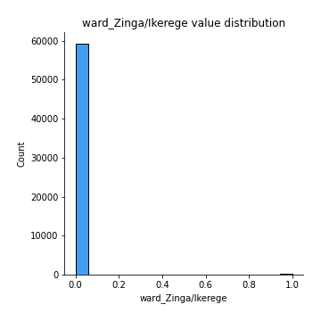
## Feature : public_meeting_False
- **Feature type** : discrete
- **Missing** : 0.0%
- **Unique** : 2
- **Count** :59400.0
- **Mean** :0.08510101010101011
- **Std** :0.2790342970990269
- **Min** :0.0
- **25%th Percentile** : 0.0
- **50%th Percentile** : 0.0
- **75%th Percentile** : 0.0
- **Max** :1.0

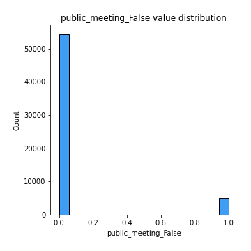
## Feature : public_meeting_True
- **Feature type** : discrete
- **Missing** : 0.0%
- **Unique** : 2
- **Count** :59400.0
- **Mean** :0.8587710437710437
- **Std** :0.348260505933202
- **Min** :0.0
- **25%th Percentile** : 1.0
- **50%th Percentile** : 1.0
- **75%th Percentile** : 1.0
- **Max** :1.0

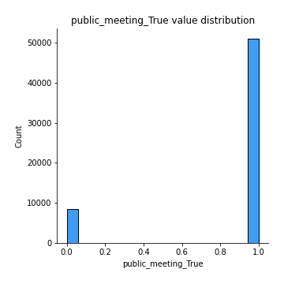
## Feature : public_meeting_no_data
- **Feature type** : discrete
- **Missing** : 0.0%
- **Unique** : 2
- **Count** :59400.0
- **Mean** :0.05612794612794613
- **Std** :0.23017057084954176
- **Min** :0.0
- **25%th Percentile** : 0.0
- **50%th Percentile** : 0.0
- **75%th Percentile** : 0.0
- **Max** :1.0

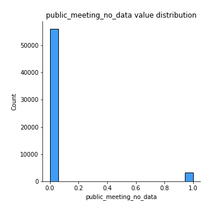
## Feature : scheme_management_Company
- **Feature type** : discrete
- **Missing** : 0.0%
- **Unique** : 2
- **Count** :59400.0
- **Mean** :0.017861952861952864
- **Std** :0.1324507411906709
- **Min** :0.0
- **25%th Percentile** : 0.0
- **50%th Percentile** : 0.0
- **75%th Percentile** : 0.0
- **Max** :1.0

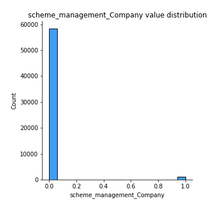
## Feature : scheme_management_None
- **Feature type** : discrete
- **Missing** : 0.0%
- **Unique** : 2
- **Count** :59400.0
- **Mean** :1.6835016835016834e-05
- **Std** :0.004103049699311092
- **Min** :0.0
- **25%th Percentile** : 0.0
- **50%th Percentile** : 0.0
- **75%th Percentile** : 0.0
- **Max** :1.0

## Feature : scheme_management_Other
- **Feature type** : discrete
- **Missing** : 0.0%
- **Unique** : 2
- **Count** :59400.0
- **Mean** :0.012895622895622896
- **Std** :0.11282526360606832
- **Min** :0.0
- **25%th Percentile** : 0.0
- **50%th Percentile** : 0.0
- **75%th Percentile** : 0.0
- **Max** :1.0

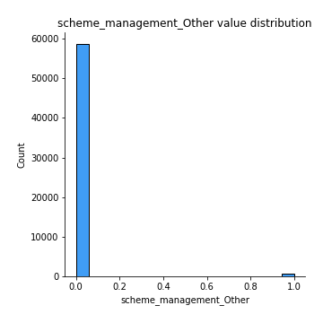
## Feature : scheme_management_Parastatal
- **Feature type** : discrete
- **Missing** : 0.0%
- **Unique** : 2
- **Count** :59400.0
- **Mean** :0.028282828282828285
- **Std** :0.16578109841050206
- **Min** :0.0
- **25%th Percentile** : 0.0
- **50%th Percentile** : 0.0
- **75%th Percentile** : 0.0
- **Max** :1.0

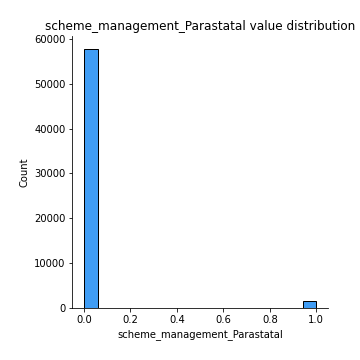
## Feature : scheme_management_Private operator
- **Feature type** : discrete
- **Missing** : 0.0%
- **Unique** : 2
- **Count** :59400.0
- **Mean** :0.017895622895622895
- **Std** :0.13257324565471165
- **Min** :0.0
- **25%th Percentile** : 0.0
- **50%th Percentile** : 0.0
- **75%th Percentile** : 0.0
- **Max** :1.0

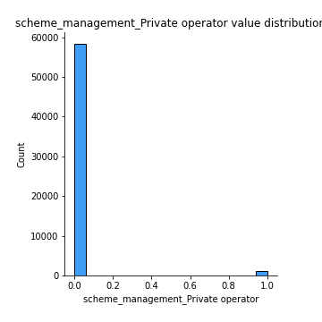
## Feature : scheme_management_SWC
- **Feature type** : discrete
- **Missing** : 0.0%
- **Unique** : 2
- **Count** :59400.0
- **Mean** :0.001632996632996633
- **Std** :0.04037768445673385
- **Min** :0.0
- **25%th Percentile** : 0.0
- **50%th Percentile** : 0.0
- **75%th Percentile** : 0.0
- **Max** :1.0

## Feature : scheme_management_Trust
- **Feature type** : discrete
- **Missing** : 0.0%
- **Unique** : 2
- **Count** :59400.0
- **Mean** :0.0012121212121212121
- **Std** :0.03479471735734941
- **Min** :0.0
- **25%th Percentile** : 0.0
- **50%th Percentile** : 0.0
- **75%th Percentile** : 0.0
- **Max** :1.0

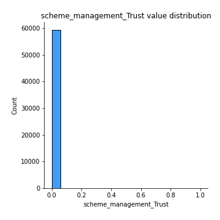
## Feature : scheme_management_VWC
- **Feature type** : discrete
- **Missing** : 0.0%
- **Unique** : 2
- **Count** :59400.0
- **Mean** :0.6194107744107744
- **Std** :0.48553582331921125
- **Min** :0.0
- **25%th Percentile** : 0.0
- **50%th Percentile** : 1.0
- **75%th Percentile** : 1.0
- **Max** :1.0

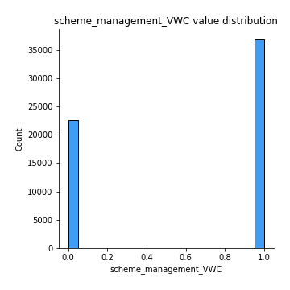
## Feature : scheme_management_WUA
- **Feature type** : discrete
- **Missing** : 0.0%
- **Unique** : 2
- **Count** :59400.0
- **Mean** :0.048535353535353536
- **Std** :0.21489637140075774
- **Min** :0.0
- **25%th Percentile** : 0.0
- **50%th Percentile** : 0.0
- **75%th Percentile** : 0.0
- **Max** :1.0

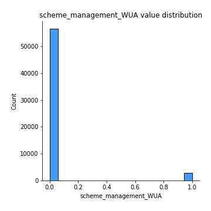
## Feature : scheme_management_WUG
- **Feature type** : discrete
- **Missing** : 0.0%
- **Unique** : 2
- **Count** :59400.0
- **Mean** :0.08764309764309765
- **Std** :0.2827775296222828
- **Min** :0.0
- **25%th Percentile** : 0.0
- **50%th Percentile** : 0.0
- **75%th Percentile** : 0.0
- **Max** :1.0

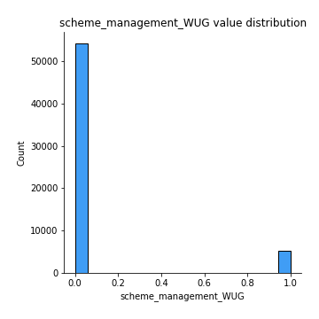
## Feature : scheme_management_Water Board
- **Feature type** : discrete
- **Missing** : 0.0%
- **Unique** : 2
- **Count** :59400.0
- **Mean** :0.04626262626262626
- **Std** :0.2100550844128513
- **Min** :0.0
- **25%th Percentile** : 0.0
- **50%th Percentile** : 0.0
- **75%th Percentile** : 0.0
- **Max** :1.0

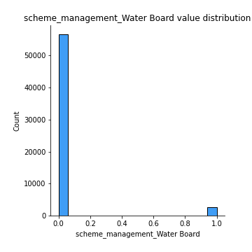
## Feature : scheme_management_Water authority
- **Feature type** : discrete
- **Missing** : 0.0%
- **Unique** : 2
- **Count** :59400.0
- **Mean** :0.05308080808080808
- **Std** :0.2241965255996727
- **Min** :0.0
- **25%th Percentile** : 0.0
- **50%th Percentile** : 0.0
- **75%th Percentile** : 0.0
- **Max** :1.0

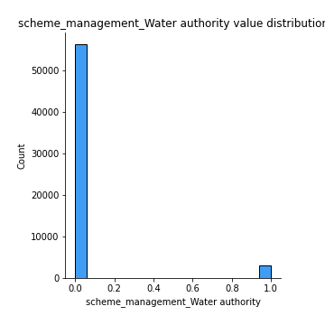
## Feature : scheme_management_no_data
- **Feature type** : discrete
- **Missing** : 0.0%
- **Unique** : 2
- **Count** :59400.0
- **Mean** :0.06526936026936027
- **Std** :0.2470026274936817
- **Min** :0.0
- **25%th Percentile** : 0.0
- **50%th Percentile** : 0.0
- **75%th Percentile** : 0.0
- **Max** :1.0

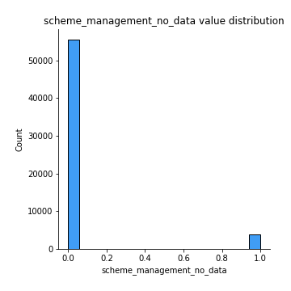
## Feature : scheme_name_Bagamoyo wate
- **Feature type** : discrete
- **Missing** : 0.0%
- **Unique** : 2
- **Count** :59400.0
- **Mean** :0.003855218855218855
- **Std** :0.06197112873222483
- **Min** :0.0
- **25%th Percentile** : 0.0
- **50%th Percentile** : 0.0
- **75%th Percentile** : 0.0
- **Max** :1.0

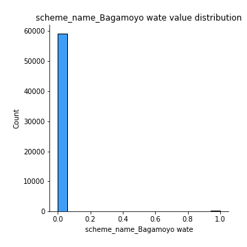
## Feature : scheme_name_Borehole
- **Feature type** : discrete
- **Missing** : 0.0%
- **Unique** : 2
- **Count** :59400.0
- **Mean** :0.009191919191919192
- **Std** :0.09543364783853879
- **Min** :0.0
- **25%th Percentile** : 0.0
- **50%th Percentile** : 0.0
- **75%th Percentile** : 0.0
- **Max** :1.0

## Feature : scheme_name_Chalinze wate
- **Feature type** : discrete
- **Missing** : 0.0%
- **Unique** : 2
- **Count** :59400.0
- **Mean** :0.006818181818181818
- **Std** :0.08229099718912997
- **Min** :0.0
- **25%th Percentile** : 0.0
- **50%th Percentile** : 0.0
- **75%th Percentile** : 0.0
- **Max** :1.0

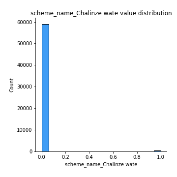
## Feature : scheme_name_DANIDA
- **Feature type** : discrete
- **Missing** : 0.0%
- **Unique** : 2
- **Count** :59400.0
- **Mean** :0.0063804713804713805
- **Std** :0.07962328614930297
- **Min** :0.0
- **25%th Percentile** : 0.0
- **50%th Percentile** : 0.0
- **75%th Percentile** : 0.0
- **Max** :1.0

## Feature : scheme_name_Government
- **Feature type** : discrete
- **Missing** : 0.0%
- **Unique** : 2
- **Count** :59400.0
- **Mean** :0.0053872053872053875
- **Std** :0.07320022958944812
- **Min** :0.0
- **25%th Percentile** : 0.0
- **50%th Percentile** : 0.0
- **75%th Percentile** : 0.0
- **Max** :1.0

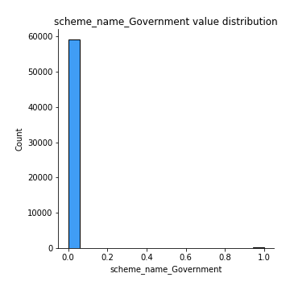
## Feature : scheme_name_Handeni Trunk Main(H
- **Feature type** : discrete
- **Missing** : 0.0%
- **Unique** : 2
- **Count** :59400.0
- **Mean** :0.0025589225589225588
- **Std** :0.05052145528634979
- **Min** :0.0
- **25%th Percentile** : 0.0
- **50%th Percentile** : 0.0
- **75%th Percentile** : 0.0
- **Max** :1.0

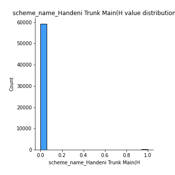
## Feature : scheme_name_I
- **Feature type** : discrete
- **Missing** : 0.0%
- **Unique** : 2
- **Count** :59400.0
- **Mean** :0.003855218855218855
- **Std** :0.06197112873222483
- **Min** :0.0
- **25%th Percentile** : 0.0
- **50%th Percentile** : 0.0
- **75%th Percentile** : 0.0
- **Max** :1.0

## Feature : scheme_name_K
- **Feature type** : discrete
- **Missing** : 0.0%
- **Unique** : 2
- **Count** :59400.0
- **Mean** :0.011481481481481481
- **Std** :0.10653566604361371
- **Min** :0.0
- **25%th Percentile** : 0.0
- **50%th Percentile** : 0.0
- **75%th Percentile** : 0.0
- **Max** :1.0

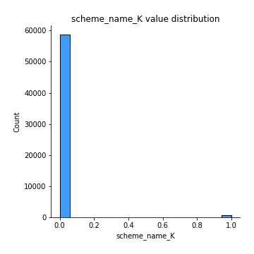
## Feature : scheme_name_Kijiji
- **Feature type** : discrete
- **Missing** : 0.0%
- **Unique** : 2
- **Count** :59400.0
- **Mean** :0.0027104377104377104
- **Std** :0.05199169881056168
- **Min** :0.0
- **25%th Percentile** : 0.0
- **50%th Percentile** : 0.0
- **75%th Percentile** : 0.0
- **Max** :1.0

## Feature : scheme_name_Kirua kahe gravity water supply trust
- **Feature type** : discrete
- **Missing** : 0.0%
- **Unique** : 2
- **Count** :59400.0
- **Mean** :0.003249158249158249
- **Std** :0.056909188560847764
- **Min** :0.0
- **25%th Percentile** : 0.0
- **50%th Percentile** : 0.0
- **75%th Percentile** : 0.0
- **Max** :1.0

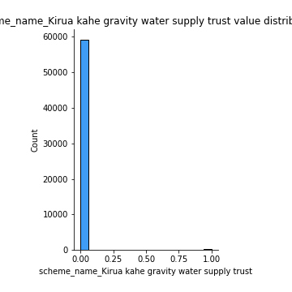
## Feature : scheme_name_M
- **Feature type** : discrete
- **Missing** : 0.0%
- **Unique** : 2
- **Count** :59400.0
- **Mean** :0.006734006734006734
- **Std** :0.08178491604758552
- **Min** :0.0
- **25%th Percentile** : 0.0
- **50%th Percentile** : 0.0
- **75%th Percentile** : 0.0
- **Max** :1.0

## Feature : scheme_name_Machumba estate pipe line
- **Feature type** : discrete
- **Missing** : 0.0%
- **Unique** : 2
- **Count** :59400.0
- **Mean** :0.0031144781144781144
- **Std** :0.05572100510960637
- **Min** :0.0
- **25%th Percentile** : 0.0
- **50%th Percentile** : 0.0
- **75%th Percentile** : 0.0
- **Max** :1.0

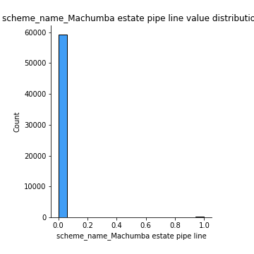
## Feature : scheme_name_Makwale water supplied sche
- **Feature type** : discrete
- **Missing** : 0.0%
- **Unique** : 2
- **Count** :59400.0
- **Mean** :0.0027946127946127945
- **Std** :0.0527906227525792
- **Min** :0.0
- **25%th Percentile** : 0.0
- **50%th Percentile** : 0.0
- **75%th Percentile** : 0.0
- **Max** :1.0

## Feature : scheme_name_N
- **Feature type** : discrete
- **Missing** : 0.0%
- **Unique** : 2
- **Count** :59400.0
- **Mean** :0.0034343434343434343
- **Std** :0.058503045554515846
- **Min** :0.0
- **25%th Percentile** : 0.0
- **50%th Percentile** : 0.0
- **75%th Percentile** : 0.0
- **Max** :1.0

## Feature : scheme_name_Ngana water supplied scheme
- **Feature type** : discrete
- **Missing** : 0.0%
- **Unique** : 2
- **Count** :59400.0
- **Mean** :0.004545454545454545
- **Std** :0.06726715071032109
- **Min** :0.0
- **25%th Percentile** : 0.0
- **50%th Percentile** : 0.0
- **75%th Percentile** : 0.0
- **Max** :1.0

## Feature : scheme_name_None
- **Feature type** : discrete
- **Missing** : 0.0%
- **Unique** : 2
- **Count** :59400.0
- **Mean** :0.010841750841750842
- **Std** :0.10355862023842259
- **Min** :0.0
- **25%th Percentile** : 0.0
- **50%th Percentile** : 0.0
- **75%th Percentile** : 0.0
- **Max** :1.0

## Feature : scheme_name_Other
- **Feature type** : discrete
- **Missing** : 0.0%
- **Unique** : 2
- **Count** :59400.0
- **Mean** :0.427020202020202
- **Std** :0.49464943975125036
- **Min** :0.0
- **25%th Percentile** : 0.0
- **50%th Percentile** : 0.0
- **75%th Percentile** : 1.0
- **Max** :1.0

## Feature : scheme_name_Uroki-Bomang'ombe water sup
- **Feature type** : discrete
- **Missing** : 0.0%
- **Unique** : 2
- **Count** :59400.0
- **Mean** :0.0035185185185185185
- **Std** :0.05921315371476619
- **Min** :0.0
- **25%th Percentile** : 0.0
- **50%th Percentile** : 0.0
- **75%th Percentile** : 0.0
- **Max** :1.0

## Feature : scheme_name_no_data
- **Feature type** : discrete
- **Missing** : 0.0%
- **Unique** : 2
- **Count** :59400.0
- **Mean** :0.4741750841750842
- **Std** :0.4993368315273731
- **Min** :0.0
- **25%th Percentile** : 0.0
- **50%th Percentile** : 0.0
- **75%th Percentile** : 1.0
- **Max** :1.0

## Feature : scheme_name_wanging'ombe supply scheme
- **Feature type** : discrete
- **Missing** : 0.0%
- **Unique** : 2
- **Count** :59400.0
- **Mean** :0.00393939393939394
- **Std** :0.062641369512487
- **Min** :0.0
- **25%th Percentile** : 0.0
- **50%th Percentile** : 0.0
- **75%th Percentile** : 0.0
- **Max** :1.0

## Feature : scheme_name_wanging'ombe water supply s
- **Feature type** : discrete
- **Missing** : 0.0%
- **Unique** : 2
- **Count** :59400.0
- **Mean** :0.004393939393939394
- **Std** :0.06614156286932327
- **Min** :0.0
- **25%th Percentile** : 0.0
- **50%th Percentile** : 0.0
- **75%th Percentile** : 0.0
- **Max** :1.0

## Feature : permit_False
- **Feature type** : discrete
- **Missing** : 0.0%
- **Unique** : 2
- **Count** :59400.0
- **Mean** :0.2944781144781145
- **Std** :0.45581164123595386
- **Min** :0.0
- **25%th Percentile** : 0.0
- **50%th Percentile** : 0.0
- **75%th Percentile** : 1.0
- **Max** :1.0

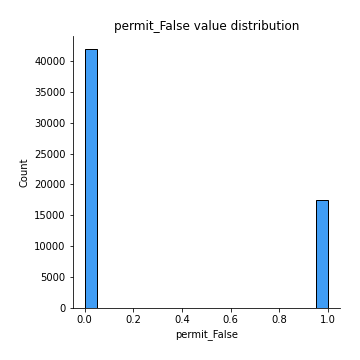
## Feature : permit_True
- **Feature type** : discrete
- **Missing** : 0.0%
- **Unique** : 2
- **Count** :59400.0
- **Mean** :0.654074074074074
- **Std** :0.47567319545367864
- **Min** :0.0
- **25%th Percentile** : 0.0
- **50%th Percentile** : 1.0
- **75%th Percentile** : 1.0
- **Max** :1.0

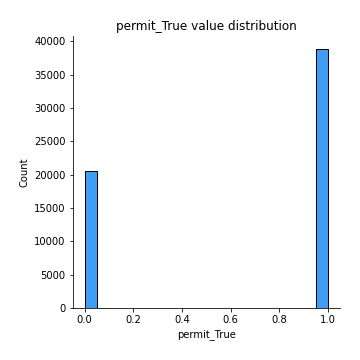
## Feature : permit_no_data
- **Feature type** : discrete
- **Missing** : 0.0%
- **Unique** : 2
- **Count** :59400.0
- **Mean** :0.05144781144781145
- **Std** :0.22091119420124702
- **Min** :0.0
- **25%th Percentile** : 0.0
- **50%th Percentile** : 0.0
- **75%th Percentile** : 0.0
- **Max** :1.0

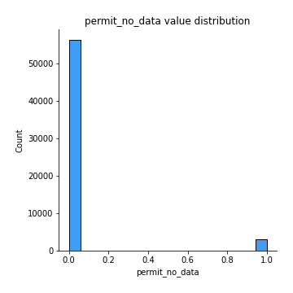
## Feature : extraction_type_afridev
- **Feature type** : discrete
- **Missing** : 0.0%
- **Unique** : 2
- **Count** :59400.0
- **Mean** :0.0297979797979798
- **Std** :0.17003101748646596
- **Min** :0.0
- **25%th Percentile** : 0.0
- **50%th Percentile** : 0.0
- **75%th Percentile** : 0.0
- **Max** :1.0

## Feature : extraction_type_cemo
- **Feature type** : discrete
- **Missing** : 0.0%
- **Unique** : 2
- **Count** :59400.0
- **Mean** :0.0015151515151515152
- **Std** :0.038895774840203554
- **Min** :0.0
- **25%th Percentile** : 0.0
- **50%th Percentile** : 0.0
- **75%th Percentile** : 0.0
- **Max** :1.0

## Feature : extraction_type_climax
- **Feature type** : discrete
- **Missing** : 0.0%
- **Unique** : 2
- **Count** :59400.0
- **Mean** :0.0005387205387205387
- **Std** :0.023204296661131232
- **Min** :0.0
- **25%th Percentile** : 0.0
- **50%th Percentile** : 0.0
- **75%th Percentile** : 0.0
- **Max** :1.0

## Feature : extraction_type_gravity
- **Feature type** : discrete
- **Missing** : 0.0%
- **Unique** : 2
- **Count** :59400.0
- **Mean** :0.4508417508417508
- **Std** :0.49758178692722815
- **Min** :0.0
- **25%th Percentile** : 0.0
- **50%th Percentile** : 0.0
- **75%th Percentile** : 1.0
- **Max** :1.0

## Feature : extraction_type_india mark ii
- **Feature type** : discrete
- **Missing** : 0.0%
- **Unique** : 2
- **Count** :59400.0
- **Mean** :0.04040404040404041
- **Std** :0.19690659372865305
- **Min** :0.0
- **25%th Percentile** : 0.0
- **50%th Percentile** : 0.0
- **75%th Percentile** : 0.0
- **Max** :1.0

## Feature : extraction_type_india mark iii
- **Feature type** : discrete
- **Missing** : 0.0%
- **Unique** : 2
- **Count** :59400.0
- **Mean** :0.00164983164983165
- **Std** :0.040584940987333104
- **Min** :0.0
- **25%th Percentile** : 0.0
- **50%th Percentile** : 0.0
- **75%th Percentile** : 0.0
- **Max** :1.0

## Feature : extraction_type_ksb
- **Feature type** : discrete
- **Missing** : 0.0%
- **Unique** : 2
- **Count** :59400.0
- **Mean** :0.02382154882154882
- **Std** :0.1524941773404963
- **Min** :0.0
- **25%th Percentile** : 0.0
- **50%th Percentile** : 0.0
- **75%th Percentile** : 0.0
- **Max** :1.0

## Feature : extraction_type_mono
- **Feature type** : discrete
- **Missing** : 0.0%
- **Unique** : 2
- **Count** :59400.0
- **Mean** :0.04823232323232323
- **Std** :0.21425857991842706
- **Min** :0.0
- **25%th Percentile** : 0.0
- **50%th Percentile** : 0.0
- **75%th Percentile** : 0.0
- **Max** :1.0

## Feature : extraction_type_nira/tanira
- **Feature type** : discrete
- **Missing** : 0.0%
- **Unique** : 2
- **Count** :59400.0
- **Mean** :0.13727272727272727
- **Std** :0.3441379365986213
- **Min** :0.0
- **25%th Percentile** : 0.0
- **50%th Percentile** : 0.0
- **75%th Percentile** : 0.0
- **Max** :1.0

## Feature : extraction_type_other
- **Feature type** : discrete
- **Missing** : 0.0%
- **Unique** : 2
- **Count** :59400.0
- **Mean** :0.10824915824915825
- **Std** :0.31069744627298773
- **Min** :0.0
- **25%th Percentile** : 0.0
- **50%th Percentile** : 0.0
- **75%th Percentile** : 0.0
- **Max** :1.0

## Feature : extraction_type_other - mkulima/shinyanga
- **Feature type** : discrete
- **Missing** : 0.0%
- **Unique** : 2
- **Count** :59400.0
- **Mean** :3.367003367003367e-05
- **Std** :0.005802539687490913
- **Min** :0.0
- **25%th Percentile** : 0.0
- **50%th Percentile** : 0.0
- **75%th Percentile** : 0.0
- **Max** :1.0

## Feature : extraction_type_other - play pump
- **Feature type** : discrete
- **Missing** : 0.0%
- **Unique** : 2
- **Count** :59400.0
- **Mean** :0.001430976430976431
- **Std** :0.03780149195302697
- **Min** :0.0
- **25%th Percentile** : 0.0
- **50%th Percentile** : 0.0
- **75%th Percentile** : 0.0
- **Max** :1.0

## Feature : extraction_type_other - rope pump
- **Feature type** : discrete
- **Missing** : 0.0%
- **Unique** : 2
- **Count** :59400.0
- **Mean** :0.007592592592592593
- **Std** :0.08680479239868727
- **Min** :0.0
- **25%th Percentile** : 0.0
- **50%th Percentile** : 0.0
- **75%th Percentile** : 0.0
- **Max** :1.0

## Feature : extraction_type_other - swn 81
- **Feature type** : discrete
- **Missing** : 0.0%
- **Unique** : 2
- **Count** :59400.0
- **Mean** :0.003855218855218855
- **Std** :0.06197112873222483
- **Min** :0.0
- **25%th Percentile** : 0.0
- **50%th Percentile** : 0.0
- **75%th Percentile** : 0.0
- **Max** :1.0

## Feature : extraction_type_submersible
- **Feature type** : discrete
- **Missing** : 0.0%
- **Unique** : 2
- **Count** :59400.0
- **Mean** :0.0802020202020202
- **Std** :0.2716079860605101
- **Min** :0.0
- **25%th Percentile** : 0.0
- **50%th Percentile** : 0.0
- **75%th Percentile** : 0.0
- **Max** :1.0

## Feature : extraction_type_swn 80
- **Feature type** : discrete
- **Missing** : 0.0%
- **Unique** : 2
- **Count** :59400.0
- **Mean** :0.06178451178451178
- **Std** :0.2407657820020129
- **Min** :0.0
- **25%th Percentile** : 0.0
- **50%th Percentile** : 0.0
- **75%th Percentile** : 0.0
- **Max** :1.0

## Feature : extraction_type_walimi
- **Feature type** : discrete
- **Missing** : 0.0%
- **Unique** : 2
- **Count** :59400.0
- **Mean** :0.0008080808080808081
- **Std** :0.028415513487848428
- **Min** :0.0
- **25%th Percentile** : 0.0
- **50%th Percentile** : 0.0
- **75%th Percentile** : 0.0
- **Max** :1.0

## Feature : extraction_type_windmill
- **Feature type** : discrete
- **Missing** : 0.0%
- **Unique** : 2
- **Count** :59400.0
- **Mean** :0.00196969696969697
- **Std** :0.044337911076960085
- **Min** :0.0
- **25%th Percentile** : 0.0
- **50%th Percentile** : 0.0
- **75%th Percentile** : 0.0
- **Max** :1.0

## Feature : management_company
- **Feature type** : discrete
- **Missing** : 0.0%
- **Unique** : 2
- **Count** :59400.0
- **Mean** :0.011531986531986532
- **Std** :0.10676699735497479
- **Min** :0.0
- **25%th Percentile** : 0.0
- **50%th Percentile** : 0.0
- **75%th Percentile** : 0.0
- **Max** :1.0

## Feature : management_other
- **Feature type** : discrete
- **Missing** : 0.0%
- **Unique** : 2
- **Count** :59400.0
- **Mean** :0.014208754208754209
- **Std** :0.1183516004216926
- **Min** :0.0
- **25%th Percentile** : 0.0
- **50%th Percentile** : 0.0
- **75%th Percentile** : 0.0
- **Max** :1.0

## Feature : management_other - school
- **Feature type** : discrete
- **Missing** : 0.0%
- **Unique** : 2
- **Count** :59400.0
- **Mean** :0.0016666666666666668
- **Std** :0.04079113752959004
- **Min** :0.0
- **25%th Percentile** : 0.0
- **50%th Percentile** : 0.0
- **75%th Percentile** : 0.0
- **Max** :1.0

## Feature : management_parastatal
- **Feature type** : discrete
- **Missing** : 0.0%
- **Unique** : 2
- **Count** :59400.0
- **Mean** :0.029764309764309764
- **Std** :0.1699378763108017
- **Min** :0.0
- **25%th Percentile** : 0.0
- **50%th Percentile** : 0.0
- **75%th Percentile** : 0.0
- **Max** :1.0

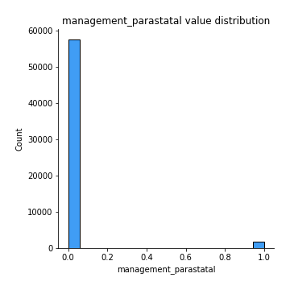
## Feature : management_private operator
- **Feature type** : discrete
- **Missing** : 0.0%
- **Unique** : 2
- **Count** :59400.0
- **Mean** :0.03318181818181818
- **Std** :0.1791126048429228
- **Min** :0.0
- **25%th Percentile** : 0.0
- **50%th Percentile** : 0.0
- **75%th Percentile** : 0.0
- **Max** :1.0

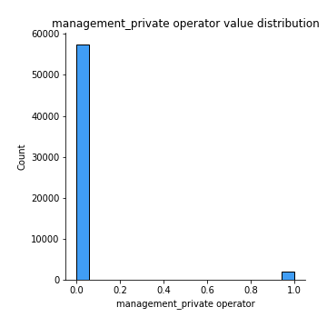
## Feature : management_trust
- **Feature type** : discrete
- **Missing** : 0.0%
- **Unique** : 2
- **Count** :59400.0
- **Mean** :0.0013131313131313131
- **Std** :0.03621365871071825
- **Min** :0.0
- **25%th Percentile** : 0.0
- **50%th Percentile** : 0.0
- **75%th Percentile** : 0.0
- **Max** :1.0

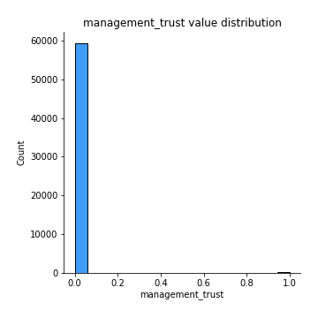
## Feature : management_unknown
- **Feature type** : discrete
- **Missing** : 0.0%
- **Unique** : 2
- **Count** :59400.0
- **Mean** :0.009444444444444445
- **Std** :0.0967233395410385
- **Min** :0.0
- **25%th Percentile** : 0.0
- **50%th Percentile** : 0.0
- **75%th Percentile** : 0.0
- **Max** :1.0

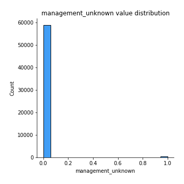
## Feature : management_vwc
- **Feature type** : discrete
- **Missing** : 0.0%
- **Unique** : 2
- **Count** :59400.0
- **Mean** :0.681936026936027
- **Std** :0.4657283904458403
- **Min** :0.0
- **25%th Percentile** : 0.0
- **50%th Percentile** : 1.0
- **75%th Percentile** : 1.0
- **Max** :1.0

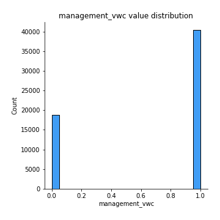
## Feature : management_water authority
- **Feature type** : discrete
- **Missing** : 0.0%
- **Unique** : 2
- **Count** :59400.0
- **Mean** :0.015218855218855219
- **Std** :0.1224234208776907
- **Min** :0.0
- **25%th Percentile** : 0.0
- **50%th Percentile** : 0.0
- **75%th Percentile** : 0.0
- **Max** :1.0

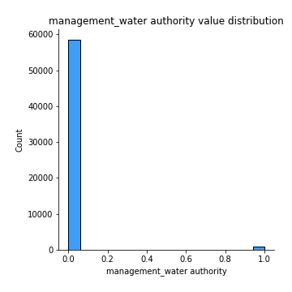
## Feature : management_water board
- **Feature type** : discrete
- **Missing** : 0.0%
- **Unique** : 2
- **Count** :59400.0
- **Mean** :0.04937710437710438
- **Std** :0.21665593962016297
- **Min** :0.0
- **25%th Percentile** : 0.0
- **50%th Percentile** : 0.0
- **75%th Percentile** : 0.0
- **Max** :1.0

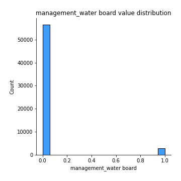
## Feature : management_wua
- **Feature type** : discrete
- **Missing** : 0.0%
- **Unique** : 2
- **Count** :59400.0
- **Mean** :0.042676767676767674
- **Std** :0.2021290404454218
- **Min** :0.0
- **25%th Percentile** : 0.0
- **50%th Percentile** : 0.0
- **75%th Percentile** : 0.0
- **Max** :1.0

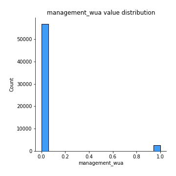
## Feature : management_wug
- **Feature type** : discrete
- **Missing** : 0.0%
- **Unique** : 2
- **Count** :59400.0
- **Mean** :0.10968013468013468
- **Std** :0.31249327466448384
- **Min** :0.0
- **25%th Percentile** : 0.0
- **50%th Percentile** : 0.0
- **75%th Percentile** : 0.0
- **Max** :1.0

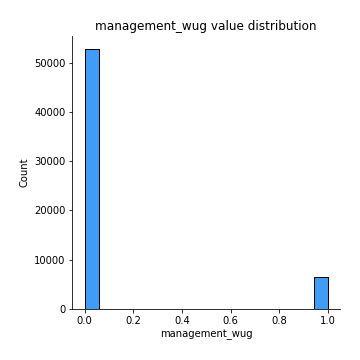
## Feature : payment_type_annually
- **Feature type** : discrete
- **Missing** : 0.0%
- **Unique** : 2
- **Count** :59400.0
- **Mean** :0.06131313131313131
- **Std** :0.2399058152228494
- **Min** :0.0
- **25%th Percentile** : 0.0
- **50%th Percentile** : 0.0
- **75%th Percentile** : 0.0
- **Max** :1.0

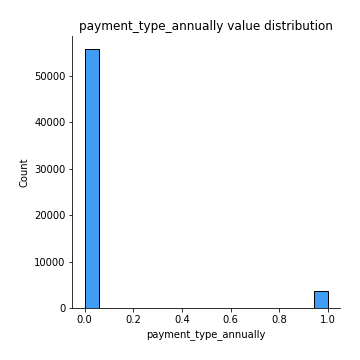
## Feature : payment_type_monthly
- **Feature type** : discrete
- **Missing** : 0.0%
- **Unique** : 2
- **Count** :59400.0
- **Mean** :0.13973063973063973
- **Std** :0.3467102706223274
- **Min** :0.0
- **25%th Percentile** : 0.0
- **50%th Percentile** : 0.0
- **75%th Percentile** : 0.0
- **Max** :1.0

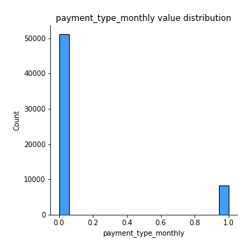
## Feature : payment_type_never pay
- **Feature type** : discrete
- **Missing** : 0.0%
- **Unique** : 2
- **Count** :59400.0
- **Mean** :0.42673400673400674
- **Std** :0.49460712963472986
- **Min** :0.0
- **25%th Percentile** : 0.0
- **50%th Percentile** : 0.0
- **75%th Percentile** : 1.0
- **Max** :1.0

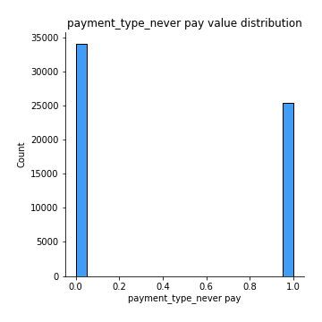
## Feature : payment_type_on failure
- **Feature type** : discrete
- **Missing** : 0.0%
- **Unique** : 2
- **Count** :59400.0
- **Mean** :0.06589225589225589
- **Std** :0.2480957531403348
- **Min** :0.0
- **25%th Percentile** : 0.0
- **50%th Percentile** : 0.0
- **75%th Percentile** : 0.0
- **Max** :1.0

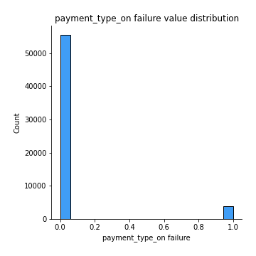
## Feature : payment_type_other
- **Feature type** : discrete
- **Missing** : 0.0%
- **Unique** : 2
- **Count** :59400.0
- **Mean** :0.017744107744107743
- **Std** :0.13202101276389328
- **Min** :0.0
- **25%th Percentile** : 0.0
- **50%th Percentile** : 0.0
- **75%th Percentile** : 0.0
- **Max** :1.0

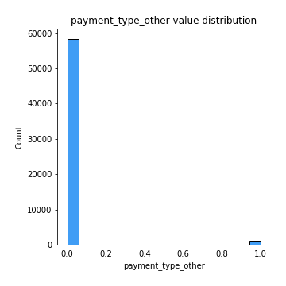
## Feature : payment_type_per bucket
- **Feature type** : discrete
- **Missing** : 0.0%
- **Unique** : 2
- **Count** :59400.0
- **Mean** :0.15126262626262627
- **Std** :0.35830769669710905
- **Min** :0.0
- **25%th Percentile** : 0.0
- **50%th Percentile** : 0.0
- **75%th Percentile** : 0.0
- **Max** :1.0

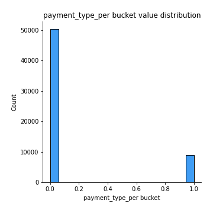
## Feature : payment_type_unknown
- **Feature type** : discrete
- **Missing** : 0.0%
- **Unique** : 2
- **Count** :59400.0
- **Mean** :0.13732323232323232
- **Std** :0.3441911628598873
- **Min** :0.0
- **25%th Percentile** : 0.0
- **50%th Percentile** : 0.0
- **75%th Percentile** : 0.0
- **Max** :1.0

## Feature : water_quality_coloured
- **Feature type** : discrete
- **Missing** : 0.0%
- **Unique** : 2
- **Count** :59400.0
- **Mean** :0.008249158249158249
- **Std** :0.09045024803048235
- **Min** :0.0
- **25%th Percentile** : 0.0
- **50%th Percentile** : 0.0
- **75%th Percentile** : 0.0
- **Max** :1.0

## Feature : water_quality_fluoride
- **Feature type** : discrete
- **Missing** : 0.0%
- **Unique** : 2
- **Count** :59400.0
- **Mean** :0.003367003367003367
- **Std** :0.05792860389294447
- **Min** :0.0
- **25%th Percentile** : 0.0
- **50%th Percentile** : 0.0
- **75%th Percentile** : 0.0
- **Max** :1.0

## Feature : water_quality_fluoride abandoned
- **Feature type** : discrete
- **Missing** : 0.0%
- **Unique** : 2
- **Count** :59400.0
- **Mean** :0.0002861952861952862
- **Std** :0.01691502868038005
- **Min** :0.0
- **25%th Percentile** : 0.0
- **50%th Percentile** : 0.0
- **75%th Percentile** : 0.0
- **Max** :1.0

## Feature : water_quality_milky
- **Feature type** : discrete
- **Missing** : 0.0%
- **Unique** : 2
- **Count** :59400.0
- **Mean** :0.013535353535353536
- **Std** :0.11555246655715672
- **Min** :0.0
- **25%th Percentile** : 0.0
- **50%th Percentile** : 0.0
- **75%th Percentile** : 0.0
- **Max** :1.0

## Feature : water_quality_salty
- **Feature type** : discrete
- **Missing** : 0.0%
- **Unique** : 2
- **Count** :59400.0
- **Mean** :0.08175084175084175
- **Std** :0.27398705336230206
- **Min** :0.0
- **25%th Percentile** : 0.0
- **50%th Percentile** : 0.0
- **75%th Percentile** : 0.0
- **Max** :1.0

## Feature : water_quality_salty abandoned
- **Feature type** : discrete
- **Missing** : 0.0%
- **Unique** : 2
- **Count** :59400.0
- **Mean** :0.005707070707070707
- **Std** :0.07532991160838685
- **Min** :0.0
- **25%th Percentile** : 0.0
- **50%th Percentile** : 0.0
- **75%th Percentile** : 0.0
- **Max** :1.0

## Feature : water_quality_soft
- **Feature type** : discrete
- **Missing** : 0.0%
- **Unique** : 2
- **Count** :59400.0
- **Mean** :0.8555218855218856
- **Std** :0.35157683346403357
- **Min** :0.0
- **25%th Percentile** : 1.0
- **50%th Percentile** : 1.0
- **75%th Percentile** : 1.0
- **Max** :1.0

## Feature : water_quality_unknown
- **Feature type** : discrete
- **Missing** : 0.0%
- **Unique** : 2
- **Count** :59400.0
- **Mean** :0.03158249158249158
- **Std** :0.17488725715794254
- **Min** :0.0
- **25%th Percentile** : 0.0
- **50%th Percentile** : 0.0
- **75%th Percentile** : 0.0
- **Max** :1.0

## Feature : quantity_dry
- **Feature type** : discrete
- **Missing** : 0.0%
- **Unique** : 2
- **Count** :59400.0
- **Mean** :0.10515151515151515
- **Std** :0.30675113386089625
- **Min** :0.0
- **25%th Percentile** : 0.0
- **50%th Percentile** : 0.0
- **75%th Percentile** : 0.0
- **Max** :1.0

## Feature : quantity_enough
- **Feature type** : discrete
- **Missing** : 0.0%
- **Unique** : 2
- **Count** :59400.0
- **Mean** :0.5586868686868687
- **Std** :0.49654808657925525
- **Min** :0.0
- **25%th Percentile** : 0.0
- **50%th Percentile** : 1.0
- **75%th Percentile** : 1.0
- **Max** :1.0

## Feature : quantity_insufficient
- **Feature type** : discrete
- **Missing** : 0.0%
- **Unique** : 2
- **Count** :59400.0
- **Mean** :0.2546969696969697
- **Std** :0.43569441023380606
- **Min** :0.0
- **25%th Percentile** : 0.0
- **50%th Percentile** : 0.0
- **75%th Percentile** : 1.0
- **Max** :1.0

## Feature : quantity_seasonal
- **Feature type** : discrete
- **Missing** : 0.0%
- **Unique** : 2
- **Count** :59400.0
- **Mean** :0.06818181818181818
- **Std** :0.25205976959710347
- **Min** :0.0
- **25%th Percentile** : 0.0
- **50%th Percentile** : 0.0
- **75%th Percentile** : 0.0
- **Max** :1.0

## Feature : quantity_unknown
- **Feature type** : discrete
- **Missing** : 0.0%
- **Unique** : 2
- **Count** :59400.0
- **Mean** :0.013282828282828283
- **Std** :0.1144841273091086
- **Min** :0.0
- **25%th Percentile** : 0.0
- **50%th Percentile** : 0.0
- **75%th Percentile** : 0.0
- **Max** :1.0

## Feature : source_dam
- **Feature type** : discrete
- **Missing** : 0.0%
- **Unique** : 2
- **Count** :59400.0
- **Mean** :0.011043771043771043
- **Std** :0.1045083252032581
- **Min** :0.0
- **25%th Percentile** : 0.0
- **50%th Percentile** : 0.0
- **75%th Percentile** : 0.0
- **Max** :1.0

## Feature : source_hand dtw
- **Feature type** : discrete
- **Missing** : 0.0%
- **Unique** : 2
- **Count** :59400.0
- **Mean** :0.014713804713804714
- **Std** :0.12040578362849946
- **Min** :0.0
- **25%th Percentile** : 0.0
- **50%th Percentile** : 0.0
- **75%th Percentile** : 0.0
- **Max** :1.0

## Feature : source_lake
- **Feature type** : discrete
- **Missing** : 0.0%
- **Unique** : 2
- **Count** :59400.0
- **Mean** :0.012878787878787878
- **Std** :0.11275255530348553
- **Min** :0.0
- **25%th Percentile** : 0.0
- **50%th Percentile** : 0.0
- **75%th Percentile** : 0.0
- **Max** :1.0

## Feature : source_machine dbh
- **Feature type** : discrete
- **Missing** : 0.0%
- **Unique** : 2
- **Count** :59400.0
- **Mean** :0.18644781144781145
- **Std** :0.38947089585368794
- **Min** :0.0
- **25%th Percentile** : 0.0
- **50%th Percentile** : 0.0
- **75%th Percentile** : 0.0
- **Max** :1.0

## Feature : source_other
- **Feature type** : discrete
- **Missing** : 0.0%
- **Unique** : 2
- **Count** :59400.0
- **Mean** :0.003569023569023569
- **Std** :0.059635103009250116
- **Min** :0.0
- **25%th Percentile** : 0.0
- **50%th Percentile** : 0.0
- **75%th Percentile** : 0.0
- **Max** :1.0

## Feature : source_rainwater harvesting
- **Feature type** : discrete
- **Missing** : 0.0%
- **Unique** : 2
- **Count** :59400.0
- **Mean** :0.038636363636363635
- **Std** :0.19272835900535623
- **Min** :0.0
- **25%th Percentile** : 0.0
- **50%th Percentile** : 0.0
- **75%th Percentile** : 0.0
- **Max** :1.0

## Feature : source_river
- **Feature type** : discrete
- **Missing** : 0.0%
- **Unique** : 2
- **Count** :59400.0
- **Mean** :0.1618181818181818
- **Std** :0.36828703652788736
- **Min** :0.0
- **25%th Percentile** : 0.0
- **50%th Percentile** : 0.0
- **75%th Percentile** : 0.0
- **Max** :1.0

## Feature : source_shallow well
- **Feature type** : discrete
- **Missing** : 0.0%
- **Unique** : 2
- **Count** :59400.0
- **Mean** :0.2832323232323232
- **Std** :0.4505720720072653
- **Min** :0.0
- **25%th Percentile** : 0.0
- **50%th Percentile** : 0.0
- **75%th Percentile** : 1.0
- **Max** :1.0

## Feature : source_spring
- **Feature type** : discrete
- **Missing** : 0.0%
- **Unique** : 2
- **Count** :59400.0
- **Mean** :0.28654882154882155
- **Std** :0.45215266913170427
- **Min** :0.0
- **25%th Percentile** : 0.0
- **50%th Percentile** : 0.0
- **75%th Percentile** : 1.0
- **Max** :1.0

## Feature : source_unknown
- **Feature type** : discrete
- **Missing** : 0.0%
- **Unique** : 2
- **Count** :59400.0
- **Mean** :0.0011111111111111111
- **Std** :0.033315090099153725
- **Min** :0.0
- **25%th Percentile** : 0.0
- **50%th Percentile** : 0.0
- **75%th Percentile** : 0.0
- **Max** :1.0

## Feature : lga_Arusha Rural
- **Feature type** : discrete
- **Missing** : 0.0%
- **Unique** : 2
- **Count** :59400.0
- **Mean** :0.021077441077441077
- **Std** :0.14364376046627175
- **Min** :0.0
- **25%th Percentile** : 0.0
- **50%th Percentile** : 0.0
- **75%th Percentile** : 0.0
- **Max** :1.0

## Feature : lga_Arusha Urban
- **Feature type** : discrete
- **Missing** : 0.0%
- **Unique** : 2
- **Count** :59400.0
- **Mean** :0.0010606060606060607
- **Std** :0.032549946421983104
- **Min** :0.0
- **25%th Percentile** : 0.0
- **50%th Percentile** : 0.0
- **75%th Percentile** : 0.0
- **Max** :1.0

## Feature : lga_Babati
- **Feature type** : discrete
- **Missing** : 0.0%
- **Unique** : 2
- **Count** :59400.0
- **Mean** :0.008602693602693603
- **Std** :0.09235166944069122
- **Min** :0.0
- **25%th Percentile** : 0.0
- **50%th Percentile** : 0.0
- **75%th Percentile** : 0.0
- **Max** :1.0

## Feature : lga_Bagamoyo
- **Feature type** : discrete
- **Missing** : 0.0%
- **Unique** : 2
- **Count** :59400.0
- **Mean** :0.016784511784511784
- **Std** :0.1284642743260745
- **Min** :0.0
- **25%th Percentile** : 0.0
- **50%th Percentile** : 0.0
- **75%th Percentile** : 0.0
- **Max** :1.0

## Feature : lga_Bahi
- **Feature type** : discrete
- **Missing** : 0.0%
- **Unique** : 2
- **Count** :59400.0
- **Mean** :0.003771043771043771
- **Std** :0.0612934437535032
- **Min** :0.0
- **25%th Percentile** : 0.0
- **50%th Percentile** : 0.0
- **75%th Percentile** : 0.0
- **Max** :1.0

## Feature : lga_Bariadi
- **Feature type** : discrete
- **Missing** : 0.0%
- **Unique** : 2
- **Count** :59400.0
- **Mean** :0.019814814814814816
- **Std** :0.13936468314115613
- **Min** :0.0
- **25%th Percentile** : 0.0
- **50%th Percentile** : 0.0
- **75%th Percentile** : 0.0
- **Max** :1.0

## Feature : lga_Biharamulo
- **Feature type** : discrete
- **Missing** : 0.0%
- **Unique** : 2
- **Count** :59400.0
- **Mean** :0.0067845117845117845
- **Std** :0.08208894949217257
- **Min** :0.0
- **25%th Percentile** : 0.0
- **50%th Percentile** : 0.0
- **75%th Percentile** : 0.0
- **Max** :1.0

## Feature : lga_Bukoba Rural
- **Feature type** : discrete
- **Missing** : 0.0%
- **Unique** : 2
- **Count** :59400.0
- **Mean** :0.008198653198653198
- **Std** :0.09017523041021826
- **Min** :0.0
- **25%th Percentile** : 0.0
- **50%th Percentile** : 0.0
- **75%th Percentile** : 0.0
- **Max** :1.0

## Feature : lga_Bukoba Urban
- **Feature type** : discrete
- **Missing** : 0.0%
- **Unique** : 2
- **Count** :59400.0
- **Mean** :0.0014814814814814814
- **Std** :0.03846182000812196
- **Min** :0.0
- **25%th Percentile** : 0.0
- **50%th Percentile** : 0.0
- **75%th Percentile** : 0.0
- **Max** :1.0

## Feature : lga_Bukombe
- **Feature type** : discrete
- **Missing** : 0.0%
- **Unique** : 2
- **Count** :59400.0
- **Mean** :0.008653198653198654
- **Std** :0.09262000445299824
- **Min** :0.0
- **25%th Percentile** : 0.0
- **50%th Percentile** : 0.0
- **75%th Percentile** : 0.0
- **Max** :1.0

## Feature : lga_Bunda
- **Feature type** : discrete
- **Missing** : 0.0%
- **Unique** : 2
- **Count** :59400.0
- **Mean** :0.0073737373737373735
- **Std** :0.08555400981014412
- **Min** :0.0
- **25%th Percentile** : 0.0
- **50%th Percentile** : 0.0
- **75%th Percentile** : 0.0
- **Max** :1.0

## Feature : lga_Chamwino
- **Feature type** : discrete
- **Missing** : 0.0%
- **Unique** : 2
- **Count** :59400.0
- **Mean** :0.0058417508417508415
- **Std** :0.07620841529621811
- **Min** :0.0
- **25%th Percentile** : 0.0
- **50%th Percentile** : 0.0
- **75%th Percentile** : 0.0
- **Max** :1.0

## Feature : lga_Chato
- **Feature type** : discrete
- **Missing** : 0.0%
- **Unique** : 2
- **Count** :59400.0
- **Mean** :0.003973063973063973
- **Std** :0.06290743483647726
- **Min** :0.0
- **25%th Percentile** : 0.0
- **50%th Percentile** : 0.0
- **75%th Percentile** : 0.0
- **Max** :1.0

## Feature : lga_Chunya
- **Feature type** : discrete
- **Missing** : 0.0%
- **Unique** : 2
- **Count** :59400.0
- **Mean** :0.005016835016835017
- **Std** :0.07065232069402408
- **Min** :0.0
- **25%th Percentile** : 0.0
- **50%th Percentile** : 0.0
- **75%th Percentile** : 0.0
- **Max** :1.0

## Feature : lga_Dodoma Urban
- **Feature type** : discrete
- **Missing** : 0.0%
- **Unique** : 2
- **Count** :59400.0
- **Mean** :0.006026936026936027
- **Std** :0.07739969588322784
- **Min** :0.0
- **25%th Percentile** : 0.0
- **50%th Percentile** : 0.0
- **75%th Percentile** : 0.0
- **Max** :1.0

## Feature : lga_Geita
- **Feature type** : discrete
- **Missing** : 0.0%
- **Unique** : 2
- **Count** :59400.0
- **Mean** :0.008215488215488216
- **Std** :0.09026699919014894
- **Min** :0.0
- **25%th Percentile** : 0.0
- **50%th Percentile** : 0.0
- **75%th Percentile** : 0.0
- **Max** :1.0

## Feature : lga_Hai
- **Feature type** : discrete
- **Missing** : 0.0%
- **Unique** : 2
- **Count** :59400.0
- **Mean** :0.010521885521885523
- **Std** :0.10203602658970284
- **Min** :0.0
- **25%th Percentile** : 0.0
- **50%th Percentile** : 0.0
- **75%th Percentile** : 0.0
- **Max** :1.0

## Feature : lga_Hanang
- **Feature type** : discrete
- **Missing** : 0.0%
- **Unique** : 2
- **Count** :59400.0
- **Mean** :0.004612794612794613
- **Std** :0.06776130192239313
- **Min** :0.0
- **25%th Percentile** : 0.0
- **50%th Percentile** : 0.0
- **75%th Percentile** : 0.0
- **Max** :1.0

## Feature : lga_Handeni
- **Feature type** : discrete
- **Missing** : 0.0%
- **Unique** : 2
- **Count** :59400.0
- **Mean** :0.004276094276094276
- **Std** :0.06525244037838074
- **Min** :0.0
- **25%th Percentile** : 0.0
- **50%th Percentile** : 0.0
- **75%th Percentile** : 0.0
- **Max** :1.0

## Feature : lga_Igunga
- **Feature type** : discrete
- **Missing** : 0.0%
- **Unique** : 2
- **Count** :59400.0
- **Mean** :0.00569023569023569
- **Std** :0.07521936027210759
- **Min** :0.0
- **25%th Percentile** : 0.0
- **50%th Percentile** : 0.0
- **75%th Percentile** : 0.0
- **Max** :1.0

## Feature : lga_Ilala
- **Feature type** : discrete
- **Missing** : 0.0%
- **Unique** : 2
- **Count** :59400.0
- **Mean** :0.008367003367003367
- **Std** :0.09108861786243812
- **Min** :0.0
- **25%th Percentile** : 0.0
- **50%th Percentile** : 0.0
- **75%th Percentile** : 0.0
- **Max** :1.0

## Feature : lga_Ileje
- **Feature type** : discrete
- **Missing** : 0.0%
- **Unique** : 2
- **Count** :59400.0
- **Mean** :0.0038888888888888888
- **Std** :0.06224010482079012
- **Min** :0.0
- **25%th Percentile** : 0.0
- **50%th Percentile** : 0.0
- **75%th Percentile** : 0.0
- **Max** :1.0

## Feature : lga_Ilemela
- **Feature type** : discrete
- **Missing** : 0.0%
- **Unique** : 2
- **Count** :59400.0
- **Mean** :0.0023905723905723905
- **Std** :0.048835414444958085
- **Min** :0.0
- **25%th Percentile** : 0.0
- **50%th Percentile** : 0.0
- **75%th Percentile** : 0.0
- **Max** :1.0

## Feature : lga_Iramba
- **Feature type** : discrete
- **Missing** : 0.0%
- **Unique** : 2
- **Count** :59400.0
- **Mean** :0.009158249158249159
- **Std** :0.09526031912839145
- **Min** :0.0
- **25%th Percentile** : 0.0
- **50%th Percentile** : 0.0
- **75%th Percentile** : 0.0
- **Max** :1.0

## Feature : lga_Iringa Rural
- **Feature type** : discrete
- **Missing** : 0.0%
- **Unique** : 2
- **Count** :59400.0
- **Mean** :0.012255892255892256
- **Std** :0.1100267656697773
- **Min** :0.0
- **25%th Percentile** : 0.0
- **50%th Percentile** : 0.0
- **75%th Percentile** : 0.0
- **Max** :1.0

## Feature : lga_Kahama
- **Feature type** : discrete
- **Missing** : 0.0%
- **Unique** : 2
- **Count** :59400.0
- **Mean** :0.014074074074074074
- **Std** :0.11779740285577417
- **Min** :0.0
- **25%th Percentile** : 0.0
- **50%th Percentile** : 0.0
- **75%th Percentile** : 0.0
- **Max** :1.0

## Feature : lga_Karagwe
- **Feature type** : discrete
- **Missing** : 0.0%
- **Unique** : 2
- **Count** :59400.0
- **Mean** :0.01297979797979798
- **Std** :0.11318806697999596
- **Min** :0.0
- **25%th Percentile** : 0.0
- **50%th Percentile** : 0.0
- **75%th Percentile** : 0.0
- **Max** :1.0

## Feature : lga_Karatu
- **Feature type** : discrete
- **Missing** : 0.0%
- **Unique** : 2
- **Count** :59400.0
- **Mean** :0.005488215488215488
- **Std** :0.07387954295769707
- **Min** :0.0
- **25%th Percentile** : 0.0
- **50%th Percentile** : 0.0
- **75%th Percentile** : 0.0
- **Max** :1.0

## Feature : lga_Kasulu
- **Feature type** : discrete
- **Missing** : 0.0%
- **Unique** : 2
- **Count** :59400.0
- **Mean** :0.017626262626262625
- **Std** :0.1315897754578176
- **Min** :0.0
- **25%th Percentile** : 0.0
- **50%th Percentile** : 0.0
- **75%th Percentile** : 0.0
- **Max** :1.0

## Feature : lga_Kibaha
- **Feature type** : discrete
- **Missing** : 0.0%
- **Unique** : 2
- **Count** :59400.0
- **Mean** :0.004528619528619529
- **Std** :0.0671430341077097
- **Min** :0.0
- **25%th Percentile** : 0.0
- **50%th Percentile** : 0.0
- **75%th Percentile** : 0.0
- **Max** :1.0

## Feature : lga_Kibondo
- **Feature type** : discrete
- **Missing** : 0.0%
- **Unique** : 2
- **Count** :59400.0
- **Mean** :0.014713804713804714
- **Std** :0.12040578362849945
- **Min** :0.0
- **25%th Percentile** : 0.0
- **50%th Percentile** : 0.0
- **75%th Percentile** : 0.0
- **Max** :1.0

## Feature : lga_Kigoma Rural
- **Feature type** : discrete
- **Missing** : 0.0%
- **Unique** : 2
- **Count** :59400.0
- **Mean** :0.013872053872053872
- **Std** :0.11696089215603099
- **Min** :0.0
- **25%th Percentile** : 0.0
- **50%th Percentile** : 0.0
- **75%th Percentile** : 0.0
- **Max** :1.0

## Feature : lga_Kigoma Urban
- **Feature type** : discrete
- **Missing** : 0.0%
- **Unique** : 2
- **Count** :59400.0
- **Mean** :0.0011952861952861952
- **Std** :0.03455253370082718
- **Min** :0.0
- **25%th Percentile** : 0.0
- **50%th Percentile** : 0.0
- **75%th Percentile** : 0.0
- **Max** :1.0

## Feature : lga_Kilindi
- **Feature type** : discrete
- **Missing** : 0.0%
- **Unique** : 2
- **Count** :59400.0
- **Mean** :0.0027104377104377104
- **Std** :0.05199169881056168
- **Min** :0.0
- **25%th Percentile** : 0.0
- **50%th Percentile** : 0.0
- **75%th Percentile** : 0.0
- **Max** :1.0

## Feature : lga_Kilolo
- **Feature type** : discrete
- **Missing** : 0.0%
- **Unique** : 2
- **Count** :59400.0
- **Mean** :0.005875420875420876
- **Std** :0.07642642630836506
- **Min** :0.0
- **25%th Percentile** : 0.0
- **50%th Percentile** : 0.0
- **75%th Percentile** : 0.0
- **Max** :1.0

## Feature : lga_Kilombero
- **Feature type** : discrete
- **Missing** : 0.0%
- **Unique** : 2
- **Count** :59400.0
- **Mean** :0.016144781144781146
- **Std** :0.12603330750487657
- **Min** :0.0
- **25%th Percentile** : 0.0
- **50%th Percentile** : 0.0
- **75%th Percentile** : 0.0
- **Max** :1.0

## Feature : lga_Kilosa
- **Feature type** : discrete
- **Missing** : 0.0%
- **Unique** : 2
- **Count** :59400.0
- **Mean** :0.018417508417508416
- **Std** :0.13445671480023622
- **Min** :0.0
- **25%th Percentile** : 0.0
- **50%th Percentile** : 0.0
- **75%th Percentile** : 0.0
- **Max** :1.0

## Feature : lga_Kilwa
- **Feature type** : discrete
- **Missing** : 0.0%
- **Unique** : 2
- **Count** :59400.0
- **Mean** :0.0065993265993266
- **Std** :0.08096842505699849
- **Min** :0.0
- **25%th Percentile** : 0.0
- **50%th Percentile** : 0.0
- **75%th Percentile** : 0.0
- **Max** :1.0

## Feature : lga_Kinondoni
- **Feature type** : discrete
- **Missing** : 0.0%
- **Unique** : 2
- **Count** :59400.0
- **Mean** :0.0015656565656565658
- **Std** :0.03953772378634514
- **Min** :0.0
- **25%th Percentile** : 0.0
- **50%th Percentile** : 0.0
- **75%th Percentile** : 0.0
- **Max** :1.0

## Feature : lga_Kisarawe
- **Feature type** : discrete
- **Missing** : 0.0%
- **Unique** : 2
- **Count** :59400.0
- **Mean** :0.0037542087542087542
- **Std** :0.061156991724512236
- **Min** :0.0
- **25%th Percentile** : 0.0
- **50%th Percentile** : 0.0
- **75%th Percentile** : 0.0
- **Max** :1.0

## Feature : lga_Kishapu
- **Feature type** : discrete
- **Missing** : 0.0%
- **Unique** : 2
- **Count** :59400.0
- **Mean** :0.006717171717171717
- **Std** :0.08168331315073524
- **Min** :0.0
- **25%th Percentile** : 0.0
- **50%th Percentile** : 0.0
- **75%th Percentile** : 0.0
- **Max** :1.0

## Feature : lga_Kiteto
- **Feature type** : discrete
- **Missing** : 0.0%
- **Unique** : 2
- **Count** :59400.0
- **Mean** :0.003249158249158249
- **Std** :0.056909188560847764
- **Min** :0.0
- **25%th Percentile** : 0.0
- **50%th Percentile** : 0.0
- **75%th Percentile** : 0.0
- **Max** :1.0

## Feature : lga_Kondoa
- **Feature type** : discrete
- **Missing** : 0.0%
- **Unique** : 2
- **Count** :59400.0
- **Mean** :0.008804713804713805
- **Std** :0.09342022128216536
- **Min** :0.0
- **25%th Percentile** : 0.0
- **50%th Percentile** : 0.0
- **75%th Percentile** : 0.0
- **Max** :1.0

## Feature : lga_Kongwa
- **Feature type** : discrete
- **Missing** : 0.0%
- **Unique** : 2
- **Count** :59400.0
- **Mean** :0.006077441077441077
- **Std** :0.07772134508048575
- **Min** :0.0
- **25%th Percentile** : 0.0
- **50%th Percentile** : 0.0
- **75%th Percentile** : 0.0
- **Max** :1.0

## Feature : lga_Korogwe
- **Feature type** : discrete
- **Missing** : 0.0%
- **Unique** : 2
- **Count** :59400.0
- **Mean** :0.006936026936026936
- **Std** :0.08299418308860673
- **Min** :0.0
- **25%th Percentile** : 0.0
- **50%th Percentile** : 0.0
- **75%th Percentile** : 0.0
- **Max** :1.0

## Feature : lga_Kwimba
- **Feature type** : discrete
- **Missing** : 0.0%
- **Unique** : 2
- **Count** :59400.0
- **Mean** :0.010555555555555556
- **Std** :0.10219741499975085
- **Min** :0.0
- **25%th Percentile** : 0.0
- **50%th Percentile** : 0.0
- **75%th Percentile** : 0.0
- **Max** :1.0

## Feature : lga_Kyela
- **Feature type** : discrete
- **Missing** : 0.0%
- **Unique** : 2
- **Count** :59400.0
- **Mean** :0.014461279461279461
- **Std** :0.11938337738923806
- **Min** :0.0
- **25%th Percentile** : 0.0
- **50%th Percentile** : 0.0
- **75%th Percentile** : 0.0
- **Max** :1.0

## Feature : lga_Lindi Rural
- **Feature type** : discrete
- **Missing** : 0.0%
- **Unique** : 2
- **Count** :59400.0
- **Mean** :0.006531986531986532
- **Std** :0.08055699183545664
- **Min** :0.0
- **25%th Percentile** : 0.0
- **50%th Percentile** : 0.0
- **75%th Percentile** : 0.0
- **Max** :1.0

## Feature : lga_Lindi Urban
- **Feature type** : discrete
- **Missing** : 0.0%
- **Unique** : 2
- **Count** :59400.0
- **Mean** :0.00035353535353535354
- **Std** :0.018799370097393818
- **Min** :0.0
- **25%th Percentile** : 0.0
- **50%th Percentile** : 0.0
- **75%th Percentile** : 0.0
- **Max** :1.0

## Feature : lga_Liwale
- **Feature type** : discrete
- **Missing** : 0.0%
- **Unique** : 2
- **Count** :59400.0
- **Mean** :0.0025925925925925925
- **Std** :0.05085188875702736
- **Min** :0.0
- **25%th Percentile** : 0.0
- **50%th Percentile** : 0.0
- **75%th Percentile** : 0.0
- **Max** :1.0

## Feature : lga_Longido
- **Feature type** : discrete
- **Missing** : 0.0%
- **Unique** : 2
- **Count** :59400.0
- **Mean** :0.005218855218855219
- **Std** :0.07205349520682983
- **Min** :0.0
- **25%th Percentile** : 0.0
- **50%th Percentile** : 0.0
- **75%th Percentile** : 0.0
- **Max** :1.0

## Feature : lga_Ludewa
- **Feature type** : discrete
- **Missing** : 0.0%
- **Unique** : 2
- **Count** :59400.0
- **Mean** :0.009494949494949495
- **Std** :0.09697914085819052
- **Min** :0.0
- **25%th Percentile** : 0.0
- **50%th Percentile** : 0.0
- **75%th Percentile** : 0.0
- **Max** :1.0

## Feature : lga_Lushoto
- **Feature type** : discrete
- **Missing** : 0.0%
- **Unique** : 2
- **Count** :59400.0
- **Mean** :0.011683501683501683
- **Std** :0.10745786089943729
- **Min** :0.0
- **25%th Percentile** : 0.0
- **50%th Percentile** : 0.0
- **75%th Percentile** : 0.0
- **Max** :1.0

## Feature : lga_Mafia
- **Feature type** : discrete
- **Missing** : 0.0%
- **Unique** : 2
- **Count** :59400.0
- **Mean** :0.0022222222222222222
- **Std** :0.04708844103661056
- **Min** :0.0
- **25%th Percentile** : 0.0
- **50%th Percentile** : 0.0
- **75%th Percentile** : 0.0
- **Max** :1.0

## Feature : lga_Magu
- **Feature type** : discrete
- **Missing** : 0.0%
- **Unique** : 2
- **Count** :59400.0
- **Mean** :0.013872053872053872
- **Std** :0.11696089215603099
- **Min** :0.0
- **25%th Percentile** : 0.0
- **50%th Percentile** : 0.0
- **75%th Percentile** : 0.0
- **Max** :1.0

## Feature : lga_Makete
- **Feature type** : discrete
- **Missing** : 0.0%
- **Unique** : 2
- **Count** :59400.0
- **Mean** :0.010606060606060607
- **Std** :0.1024390001265045
- **Min** :0.0
- **25%th Percentile** : 0.0
- **50%th Percentile** : 0.0
- **75%th Percentile** : 0.0
- **Max** :1.0

## Feature : lga_Manyoni
- **Feature type** : discrete
- **Missing** : 0.0%
- **Unique** : 2
- **Count** :59400.0
- **Mean** :0.006346801346801347
- **Std** :0.0794142659200113
- **Min** :0.0
- **25%th Percentile** : 0.0
- **50%th Percentile** : 0.0
- **75%th Percentile** : 0.0
- **Max** :1.0

## Feature : lga_Masasi
- **Feature type** : discrete
- **Missing** : 0.0%
- **Unique** : 2
- **Count** :59400.0
- **Mean** :0.008888888888888889
- **Std** :0.09386173267166291
- **Min** :0.0
- **25%th Percentile** : 0.0
- **50%th Percentile** : 0.0
- **75%th Percentile** : 0.0
- **Max** :1.0

## Feature : lga_Maswa
- **Feature type** : discrete
- **Missing** : 0.0%
- **Unique** : 2
- **Count** :59400.0
- **Mean** :0.01361952861952862
- **Std** :0.11590626913915414
- **Min** :0.0
- **25%th Percentile** : 0.0
- **50%th Percentile** : 0.0
- **75%th Percentile** : 0.0
- **Max** :1.0

## Feature : lga_Mbarali
- **Feature type** : discrete
- **Missing** : 0.0%
- **Unique** : 2
- **Count** :59400.0
- **Mean** :0.010538720538720538
- **Std** :0.10211675406536133
- **Min** :0.0
- **25%th Percentile** : 0.0
- **50%th Percentile** : 0.0
- **75%th Percentile** : 0.0
- **Max** :1.0

## Feature : lga_Mbeya Rural
- **Feature type** : discrete
- **Missing** : 0.0%
- **Unique** : 2
- **Count** :59400.0
- **Mean** :0.008164983164983165
- **Std** :0.0899914026587194
- **Min** :0.0
- **25%th Percentile** : 0.0
- **50%th Percentile** : 0.0
- **75%th Percentile** : 0.0
- **Max** :1.0

## Feature : lga_Mbinga
- **Feature type** : discrete
- **Missing** : 0.0%
- **Unique** : 2
- **Count** :59400.0
- **Mean** :0.012626262626262626
- **Std** :0.11165594476494264
- **Min** :0.0
- **25%th Percentile** : 0.0
- **50%th Percentile** : 0.0
- **75%th Percentile** : 0.0
- **Max** :1.0

## Feature : lga_Mbozi
- **Feature type** : discrete
- **Missing** : 0.0%
- **Unique** : 2
- **Count** :59400.0
- **Mean** :0.017407407407407406
- **Std** :0.13078485207505552
- **Min** :0.0
- **25%th Percentile** : 0.0
- **50%th Percentile** : 0.0
- **75%th Percentile** : 0.0
- **Max** :1.0

## Feature : lga_Mbulu
- **Feature type** : discrete
- **Missing** : 0.0%
- **Unique** : 2
- **Count** :59400.0
- **Mean** :0.005
- **Std** :0.07053427362367024
- **Min** :0.0
- **25%th Percentile** : 0.0
- **50%th Percentile** : 0.0
- **75%th Percentile** : 0.0
- **Max** :1.0

## Feature : lga_Meatu
- **Feature type** : discrete
- **Missing** : 0.0%
- **Unique** : 2
- **Count** :59400.0
- **Mean** :0.00787878787878788
- **Std** :0.08841291860951236
- **Min** :0.0
- **25%th Percentile** : 0.0
- **50%th Percentile** : 0.0
- **75%th Percentile** : 0.0
- **Max** :1.0

## Feature : lga_Meru
- **Feature type** : discrete
- **Missing** : 0.0%
- **Unique** : 2
- **Count** :59400.0
- **Mean** :0.016986531986531987
- **Std** :0.1292217893130764
- **Min** :0.0
- **25%th Percentile** : 0.0
- **50%th Percentile** : 0.0
- **75%th Percentile** : 0.0
- **Max** :1.0

## Feature : lga_Misenyi
- **Feature type** : discrete
- **Missing** : 0.0%
- **Unique** : 2
- **Count** :59400.0
- **Mean** :0.004377104377104377
- **Std** :0.06601529142323408
- **Min** :0.0
- **25%th Percentile** : 0.0
- **50%th Percentile** : 0.0
- **75%th Percentile** : 0.0
- **Max** :1.0

## Feature : lga_Missungwi
- **Feature type** : discrete
- **Missing** : 0.0%
- **Unique** : 2
- **Count** :59400.0
- **Mean** :0.005858585858585859
- **Std** :0.07631750050635153
- **Min** :0.0
- **25%th Percentile** : 0.0
- **50%th Percentile** : 0.0
- **75%th Percentile** : 0.0
- **Max** :1.0

## Feature : lga_Mkinga
- **Feature type** : discrete
- **Missing** : 0.0%
- **Unique** : 2
- **Count** :59400.0
- **Mean** :0.0048484848484848485
- **Std** :0.06946263940490685
- **Min** :0.0
- **25%th Percentile** : 0.0
- **50%th Percentile** : 0.0
- **75%th Percentile** : 0.0
- **Max** :1.0

## Feature : lga_Mkuranga
- **Feature type** : discrete
- **Missing** : 0.0%
- **Unique** : 2
- **Count** :59400.0
- **Mean** :0.009427609427609427
- **Std** :0.09663791610132563
- **Min** :0.0
- **25%th Percentile** : 0.0
- **50%th Percentile** : 0.0
- **75%th Percentile** : 0.0
- **Max** :1.0

## Feature : lga_Monduli
- **Feature type** : discrete
- **Missing** : 0.0%
- **Unique** : 2
- **Count** :59400.0
- **Mean** :0.003181818181818182
- **Std** :0.05631827067036474
- **Min** :0.0
- **25%th Percentile** : 0.0
- **50%th Percentile** : 0.0
- **75%th Percentile** : 0.0
- **Max** :1.0

## Feature : lga_Morogoro Rural
- **Feature type** : discrete
- **Missing** : 0.0%
- **Unique** : 2
- **Count** :59400.0
- **Mean** :0.008771043771043771
- **Std** :0.09324301008765035
- **Min** :0.0
- **25%th Percentile** : 0.0
- **50%th Percentile** : 0.0
- **75%th Percentile** : 0.0
- **Max** :1.0

## Feature : lga_Morogoro Urban
- **Feature type** : discrete
- **Missing** : 0.0%
- **Unique** : 2
- **Count** :59400.0
- **Mean** :0.0016161616161616162
- **Std** :0.04016935153054745
- **Min** :0.0
- **25%th Percentile** : 0.0
- **50%th Percentile** : 0.0
- **75%th Percentile** : 0.0
- **Max** :1.0

## Feature : lga_Moshi Rural
- **Feature type** : discrete
- **Missing** : 0.0%
- **Unique** : 2
- **Count** :59400.0
- **Mean** :0.02106060606060606
- **Std** :0.1435876179456638
- **Min** :0.0
- **25%th Percentile** : 0.0
- **50%th Percentile** : 0.0
- **75%th Percentile** : 0.0
- **Max** :1.0

## Feature : lga_Moshi Urban
- **Feature type** : discrete
- **Missing** : 0.0%
- **Unique** : 2
- **Count** :59400.0
- **Mean** :0.00132996632996633
- **Std** :0.0364447510642003
- **Min** :0.0
- **25%th Percentile** : 0.0
- **50%th Percentile** : 0.0
- **75%th Percentile** : 0.0
- **Max** :1.0

## Feature : lga_Mpanda
- **Feature type** : discrete
- **Missing** : 0.0%
- **Unique** : 2
- **Count** :59400.0
- **Mean** :0.01143097643097643
- **Std** :0.10630380733026183
- **Min** :0.0
- **25%th Percentile** : 0.0
- **50%th Percentile** : 0.0
- **75%th Percentile** : 0.0
- **Max** :1.0

## Feature : lga_Mpwapwa
- **Feature type** : discrete
- **Missing** : 0.0%
- **Unique** : 2
- **Count** :59400.0
- **Mean** :0.006531986531986532
- **Std** :0.08055699183545663
- **Min** :0.0
- **25%th Percentile** : 0.0
- **50%th Percentile** : 0.0
- **75%th Percentile** : 0.0
- **Max** :1.0

## Feature : lga_Mtwara Rural
- **Feature type** : discrete
- **Missing** : 0.0%
- **Unique** : 2
- **Count** :59400.0
- **Mean** :0.007121212121212121
- **Std** :0.08408697576399703
- **Min** :0.0
- **25%th Percentile** : 0.0
- **50%th Percentile** : 0.0
- **75%th Percentile** : 0.0
- **Max** :1.0

## Feature : lga_Mtwara Urban
- **Feature type** : discrete
- **Missing** : 0.0%
- **Unique** : 2
- **Count** :59400.0
- **Mean** :0.0020875420875420877
- **Std** :0.04564229756056615
- **Min** :0.0
- **25%th Percentile** : 0.0
- **50%th Percentile** : 0.0
- **75%th Percentile** : 0.0
- **Max** :1.0

## Feature : lga_Mufindi
- **Feature type** : discrete
- **Missing** : 0.0%
- **Unique** : 2
- **Count** :59400.0
- **Mean** :0.008754208754208754
- **Std** :0.09315427350817801
- **Min** :0.0
- **25%th Percentile** : 0.0
- **50%th Percentile** : 0.0
- **75%th Percentile** : 0.0
- **Max** :1.0

## Feature : lga_Muheza
- **Feature type** : discrete
- **Missing** : 0.0%
- **Unique** : 2
- **Count** :59400.0
- **Mean** :0.005622895622895623
- **Std** :0.07477548260335627
- **Min** :0.0
- **25%th Percentile** : 0.0
- **50%th Percentile** : 0.0
- **75%th Percentile** : 0.0
- **Max** :1.0

## Feature : lga_Muleba
- **Feature type** : discrete
- **Missing** : 0.0%
- **Unique** : 2
- **Count** :59400.0
- **Mean** :0.006767676767676768
- **Std** :0.08198773373886059
- **Min** :0.0
- **25%th Percentile** : 0.0
- **50%th Percentile** : 0.0
- **75%th Percentile** : 0.0
- **Max** :1.0

## Feature : lga_Musoma Rural
- **Feature type** : discrete
- **Missing** : 0.0%
- **Unique** : 2
- **Count** :59400.0
- **Mean** :0.006666666666666667
- **Std** :0.0813777224387713
- **Min** :0.0
- **25%th Percentile** : 0.0
- **50%th Percentile** : 0.0
- **75%th Percentile** : 0.0
- **Max** :1.0

## Feature : lga_Mvomero
- **Feature type** : discrete
- **Missing** : 0.0%
- **Unique** : 2
- **Count** :59400.0
- **Mean** :0.011296296296296296
- **Std** :0.10568291259485606
- **Min** :0.0
- **25%th Percentile** : 0.0
- **50%th Percentile** : 0.0
- **75%th Percentile** : 0.0
- **Max** :1.0

## Feature : lga_Mwanga
- **Feature type** : discrete
- **Missing** : 0.0%
- **Unique** : 2
- **Count** :59400.0
- **Mean** :0.008737373737373738
- **Std** :0.09306544927427192
- **Min** :0.0
- **25%th Percentile** : 0.0
- **50%th Percentile** : 0.0
- **75%th Percentile** : 0.0
- **Max** :1.0

## Feature : lga_Nachingwea
- **Feature type** : discrete
- **Missing** : 0.0%
- **Unique** : 2
- **Count** :59400.0
- **Mean** :0.005050505050505051
- **Std** :0.070887813103387
- **Min** :0.0
- **25%th Percentile** : 0.0
- **50%th Percentile** : 0.0
- **75%th Percentile** : 0.0
- **Max** :1.0

## Feature : lga_Namtumbo
- **Feature type** : discrete
- **Missing** : 0.0%
- **Unique** : 2
- **Count** :59400.0
- **Mean** :0.011683501683501683
- **Std** :0.10745786089943729
- **Min** :0.0
- **25%th Percentile** : 0.0
- **50%th Percentile** : 0.0
- **75%th Percentile** : 0.0
- **Max** :1.0

## Feature : lga_Nanyumbu
- **Feature type** : discrete
- **Missing** : 0.0%
- **Unique** : 2
- **Count** :59400.0
- **Mean** :0.00265993265993266
- **Std** :0.051506330483043136
- **Min** :0.0
- **25%th Percentile** : 0.0
- **50%th Percentile** : 0.0
- **75%th Percentile** : 0.0
- **Max** :1.0

## Feature : lga_Newala
- **Feature type** : discrete
- **Missing** : 0.0%
- **Unique** : 2
- **Count** :59400.0
- **Mean** :0.0038888888888888888
- **Std** :0.06224010482079012
- **Min** :0.0
- **25%th Percentile** : 0.0
- **50%th Percentile** : 0.0
- **75%th Percentile** : 0.0
- **Max** :1.0

## Feature : lga_Ngara
- **Feature type** : discrete
- **Missing** : 0.0%
- **Unique** : 2
- **Count** :59400.0
- **Mean** :0.011262626262626262
- **Std** :0.10552709124431674
- **Min** :0.0
- **25%th Percentile** : 0.0
- **50%th Percentile** : 0.0
- **75%th Percentile** : 0.0
- **Max** :1.0

## Feature : lga_Ngorongoro
- **Feature type** : discrete
- **Missing** : 0.0%
- **Unique** : 2
- **Count** :59400.0
- **Mean** :0.003383838383838384
- **Std** :0.058072754341389525
- **Min** :0.0
- **25%th Percentile** : 0.0
- **50%th Percentile** : 0.0
- **75%th Percentile** : 0.0
- **Max** :1.0

## Feature : lga_Njombe
- **Feature type** : discrete
- **Missing** : 0.0%
- **Unique** : 2
- **Count** :59400.0
- **Mean** :0.04213804713804714
- **Std** :0.20090572822869623
- **Min** :0.0
- **25%th Percentile** : 0.0
- **50%th Percentile** : 0.0
- **75%th Percentile** : 0.0
- **Max** :1.0

## Feature : lga_Nkasi
- **Feature type** : discrete
- **Missing** : 0.0%
- **Unique** : 2
- **Count** :59400.0
- **Mean** :0.007205387205387205
- **Std** :0.08457889826319716
- **Min** :0.0
- **25%th Percentile** : 0.0
- **50%th Percentile** : 0.0
- **75%th Percentile** : 0.0
- **Max** :1.0

## Feature : lga_Nyamagana
- **Feature type** : discrete
- **Missing** : 0.0%
- **Unique** : 2
- **Count** :59400.0
- **Mean** :1.6835016835016834e-05
- **Std** :0.004103049699311092
- **Min** :0.0
- **25%th Percentile** : 0.0
- **50%th Percentile** : 0.0
- **75%th Percentile** : 0.0
- **Max** :1.0

## Feature : lga_Nzega
- **Feature type** : discrete
- **Missing** : 0.0%
- **Unique** : 2
- **Count** :59400.0
- **Mean** :0.00968013468013468
- **Std** :0.09791113860603946
- **Min** :0.0
- **25%th Percentile** : 0.0
- **50%th Percentile** : 0.0
- **75%th Percentile** : 0.0
- **Max** :1.0

## Feature : lga_Pangani
- **Feature type** : discrete
- **Missing** : 0.0%
- **Unique** : 2
- **Count** :59400.0
- **Mean** :0.005134680134680135
- **Std** :0.0714730802093681
- **Min** :0.0
- **25%th Percentile** : 0.0
- **50%th Percentile** : 0.0
- **75%th Percentile** : 0.0
- **Max** :1.0

## Feature : lga_Rombo
- **Feature type** : discrete
- **Missing** : 0.0%
- **Unique** : 2
- **Count** :59400.0
- **Mean** :0.01
- **Std** :0.09949958125274976
- **Min** :0.0
- **25%th Percentile** : 0.0
- **50%th Percentile** : 0.0
- **75%th Percentile** : 0.0
- **Max** :1.0

## Feature : lga_Rorya
- **Feature type** : discrete
- **Missing** : 0.0%
- **Unique** : 2
- **Count** :59400.0
- **Mean** :0.0035353535353535356
- **Std** :0.05935414154928114
- **Min** :0.0
- **25%th Percentile** : 0.0
- **50%th Percentile** : 0.0
- **75%th Percentile** : 0.0
- **Max** :1.0

## Feature : lga_Ruangwa
- **Feature type** : discrete
- **Missing** : 0.0%
- **Unique** : 2
- **Count** :59400.0
- **Mean** :0.004898989898989899
- **Std** :0.06982171488066216
- **Min** :0.0
- **25%th Percentile** : 0.0
- **50%th Percentile** : 0.0
- **75%th Percentile** : 0.0
- **Max** :1.0

## Feature : lga_Rufiji
- **Feature type** : discrete
- **Missing** : 0.0%
- **Unique** : 2
- **Count** :59400.0
- **Mean** :0.0076430976430976435
- **Std** :0.08709080543830494
- **Min** :0.0
- **25%th Percentile** : 0.0
- **50%th Percentile** : 0.0
- **75%th Percentile** : 0.0
- **Max** :1.0

## Feature : lga_Rungwe
- **Feature type** : discrete
- **Missing** : 0.0%
- **Unique** : 2
- **Count** :59400.0
- **Mean** :0.01861952861952862
- **Std** :0.13517821348979647
- **Min** :0.0
- **25%th Percentile** : 0.0
- **50%th Percentile** : 0.0
- **75%th Percentile** : 0.0
- **Max** :1.0

## Feature : lga_Same
- **Feature type** : discrete
- **Missing** : 0.0%
- **Unique** : 2
- **Count** :59400.0
- **Mean** :0.014764309764309765
- **Std** :0.12060916139846498
- **Min** :0.0
- **25%th Percentile** : 0.0
- **50%th Percentile** : 0.0
- **75%th Percentile** : 0.0
- **Max** :1.0

## Feature : lga_Sengerema
- **Feature type** : discrete
- **Missing** : 0.0%
- **Unique** : 2
- **Count** :59400.0
- **Mean** :0.005572390572390572
- **Std** :0.07444079745546657
- **Min** :0.0
- **25%th Percentile** : 0.0
- **50%th Percentile** : 0.0
- **75%th Percentile** : 0.0
- **Max** :1.0

## Feature : lga_Serengeti
- **Feature type** : discrete
- **Missing** : 0.0%
- **Unique** : 2
- **Count** :59400.0
- **Mean** :0.012053872053872055
- **Std** :0.10912734170150615
- **Min** :0.0
- **25%th Percentile** : 0.0
- **50%th Percentile** : 0.0
- **75%th Percentile** : 0.0
- **Max** :1.0

## Feature : lga_Shinyanga Rural
- **Feature type** : discrete
- **Missing** : 0.0%
- **Unique** : 2
- **Count** :59400.0
- **Mean** :0.009898989898989899
- **Std** :0.09900083282854595
- **Min** :0.0
- **25%th Percentile** : 0.0
- **50%th Percentile** : 0.0
- **75%th Percentile** : 0.0
- **Max** :1.0

## Feature : lga_Shinyanga Urban
- **Feature type** : discrete
- **Missing** : 0.0%
- **Unique** : 2
- **Count** :59400.0
- **Mean** :0.0032154882154882157
- **Std** :0.05661451060167833
- **Min** :0.0
- **25%th Percentile** : 0.0
- **50%th Percentile** : 0.0
- **75%th Percentile** : 0.0
- **Max** :1.0

## Feature : lga_Siha
- **Feature type** : discrete
- **Missing** : 0.0%
- **Unique** : 2
- **Count** :59400.0
- **Mean** :0.007306397306397306
- **Std** :0.08516534489723247
- **Min** :0.0
- **25%th Percentile** : 0.0
- **50%th Percentile** : 0.0
- **75%th Percentile** : 0.0
- **Max** :1.0

## Feature : lga_Sikonge
- **Feature type** : discrete
- **Missing** : 0.0%
- **Unique** : 2
- **Count** :59400.0
- **Mean** :0.002861952861952862
- **Std** :0.053421064494358704
- **Min** :0.0
- **25%th Percentile** : 0.0
- **50%th Percentile** : 0.0
- **75%th Percentile** : 0.0
- **Max** :1.0

## Feature : lga_Simanjiro
- **Feature type** : discrete
- **Missing** : 0.0%
- **Unique** : 2
- **Count** :59400.0
- **Mean** :0.005185185185185185
- **Std** :0.07182190391025342
- **Min** :0.0
- **25%th Percentile** : 0.0
- **50%th Percentile** : 0.0
- **75%th Percentile** : 0.0
- **Max** :1.0

## Feature : lga_Singida Rural
- **Feature type** : discrete
- **Missing** : 0.0%
- **Unique** : 2
- **Count** :59400.0
- **Mean** :0.016750841750841752
- **Std** :0.12833755620667622
- **Min** :0.0
- **25%th Percentile** : 0.0
- **50%th Percentile** : 0.0
- **75%th Percentile** : 0.0
- **Max** :1.0

## Feature : lga_Singida Urban
- **Feature type** : discrete
- **Missing** : 0.0%
- **Unique** : 2
- **Count** :59400.0
- **Mean** :0.00297979797979798
- **Std** :0.05450659409747905
- **Min** :0.0
- **25%th Percentile** : 0.0
- **50%th Percentile** : 0.0
- **75%th Percentile** : 0.0
- **Max** :1.0

## Feature : lga_Songea Rural
- **Feature type** : discrete
- **Missing** : 0.0%
- **Unique** : 2
- **Count** :59400.0
- **Mean** :0.011666666666666667
- **Std** :0.10738132833933686
- **Min** :0.0
- **25%th Percentile** : 0.0
- **50%th Percentile** : 0.0
- **75%th Percentile** : 0.0
- **Max** :1.0

## Feature : lga_Songea Urban
- **Feature type** : discrete
- **Missing** : 0.0%
- **Unique** : 2
- **Count** :59400.0
- **Mean** :0.0013468013468013469
- **Std** :0.03667437956123526
- **Min** :0.0
- **25%th Percentile** : 0.0
- **50%th Percentile** : 0.0
- **75%th Percentile** : 0.0
- **Max** :1.0

## Feature : lga_Sumbawanga Rural
- **Feature type** : discrete
- **Missing** : 0.0%
- **Unique** : 2
- **Count** :59400.0
- **Mean** :0.008771043771043771
- **Std** :0.09324301008765033
- **Min** :0.0
- **25%th Percentile** : 0.0
- **50%th Percentile** : 0.0
- **75%th Percentile** : 0.0
- **Max** :1.0

## Feature : lga_Sumbawanga Urban
- **Feature type** : discrete
- **Missing** : 0.0%
- **Unique** : 2
- **Count** :59400.0
- **Mean** :0.0030303030303030303
- **Std** :0.05496518129975401
- **Min** :0.0
- **25%th Percentile** : 0.0
- **50%th Percentile** : 0.0
- **75%th Percentile** : 0.0
- **Max** :1.0

## Feature : lga_Tabora Urban
- **Feature type** : discrete
- **Missing** : 0.0%
- **Unique** : 2
- **Count** :59400.0
- **Mean** :0.0026094276094276096
- **Std** :0.0510162945816591
- **Min** :0.0
- **25%th Percentile** : 0.0
- **50%th Percentile** : 0.0
- **75%th Percentile** : 0.0
- **Max** :1.0

## Feature : lga_Tandahimba
- **Feature type** : discrete
- **Missing** : 0.0%
- **Unique** : 2
- **Count** :59400.0
- **Mean** :0.004478114478114478
- **Std** :0.06676927453275465
- **Min** :0.0
- **25%th Percentile** : 0.0
- **50%th Percentile** : 0.0
- **75%th Percentile** : 0.0
- **Max** :1.0

## Feature : lga_Tanga
- **Feature type** : discrete
- **Missing** : 0.0%
- **Unique** : 2
- **Count** :59400.0
- **Mean** :0.0016666666666666668
- **Std** :0.04079113752959004
- **Min** :0.0
- **25%th Percentile** : 0.0
- **50%th Percentile** : 0.0
- **75%th Percentile** : 0.0
- **Max** :1.0

## Feature : lga_Tarime
- **Feature type** : discrete
- **Missing** : 0.0%
- **Unique** : 2
- **Count** :59400.0
- **Mean** :0.0035185185185185185
- **Std** :0.05921315371476618
- **Min** :0.0
- **25%th Percentile** : 0.0
- **50%th Percentile** : 0.0
- **75%th Percentile** : 0.0
- **Max** :1.0

## Feature : lga_Temeke
- **Feature type** : discrete
- **Missing** : 0.0%
- **Unique** : 2
- **Count** :59400.0
- **Mean** :0.0036195286195286197
- **Std** :0.060054045220893124
- **Min** :0.0
- **25%th Percentile** : 0.0
- **50%th Percentile** : 0.0
- **75%th Percentile** : 0.0
- **Max** :1.0

## Feature : lga_Tunduru
- **Feature type** : discrete
- **Missing** : 0.0%
- **Unique** : 2
- **Count** :59400.0
- **Mean** :0.007121212121212121
- **Std** :0.08408697576399703
- **Min** :0.0
- **25%th Percentile** : 0.0
- **50%th Percentile** : 0.0
- **75%th Percentile** : 0.0
- **Max** :1.0

## Feature : lga_Ukerewe
- **Feature type** : discrete
- **Missing** : 0.0%
- **Unique** : 2
- **Count** :59400.0
- **Mean** :0.005740740740740741
- **Std** :0.0755505177265947
- **Min** :0.0
- **25%th Percentile** : 0.0
- **50%th Percentile** : 0.0
- **75%th Percentile** : 0.0
- **Max** :1.0

## Feature : lga_Ulanga
- **Feature type** : discrete
- **Missing** : 0.0%
- **Unique** : 2
- **Count** :59400.0
- **Mean** :0.011195286195286196
- **Std** :0.10521472391378302
- **Min** :0.0
- **25%th Percentile** : 0.0
- **50%th Percentile** : 0.0
- **75%th Percentile** : 0.0
- **Max** :1.0

## Feature : lga_Urambo
- **Feature type** : discrete
- **Missing** : 0.0%
- **Unique** : 2
- **Count** :59400.0
- **Mean** :0.006430976430976431
- **Std** :0.07993576511346222
- **Min** :0.0
- **25%th Percentile** : 0.0
- **50%th Percentile** : 0.0
- **75%th Percentile** : 0.0
- **Max** :1.0

## Feature : lga_Uyui
- **Feature type** : discrete
- **Missing** : 0.0%
- **Unique** : 2
- **Count** :59400.0
- **Mean** :0.005707070707070707
- **Std** :0.07532991160838685
- **Min** :0.0
- **25%th Percentile** : 0.0
- **50%th Percentile** : 0.0
- **75%th Percentile** : 0.0
- **Max** :1.0

## Feature : amount_tsh
- **Feature type** : continous
- **Missing** : 0.0%
- **Unique** : 98
- **Count** :59400.0
- **Mean** :317.6503846801347
- **Std** :2997.574558143226
- **Min** :0.0
- **25%th Percentile** : 0.0
- **50%th Percentile** : 0.0
- **75%th Percentile** : 20.0
- **Max** :350000.0

## Feature : gps_height
- **Feature type** : continous
- **Missing** : 0.0%
- **Unique** : 2447
- **Count** :59400.0
- **Mean** :-147288.3474871558
- **Std** :355584.63912434113
- **Min** :-999999.0
- **25%th Percentile** : 45.0
- **50%th Percentile** : 1018.0
- **75%th Percentile** : 1350.5391705069123
- **Max** :2770.0

## Feature : longitude
- **Feature type** : continous
- **Missing** : 0.0%
- **Unique** : 57518
- **Count** :59400.0
- **Mean** :35.1064222610185
- **Std** :2.5803575126790723
- **Min** :29.6071219
- **25%th Percentile** : 33.2807118725
- **50%th Percentile** : 34.90874343
- **75%th Percentile** : 37.17838657
- **Max** :40.34519307

## Feature : latitude
- **Feature type** : continous
- **Missing** : 0.0%
- **Unique** : 57517
- **Count** :59400.0
- **Mean** :-5.706032659626503
- **Std** :2.9460190812672096
- **Min** :-11.64944018
- **25%th Percentile** : -8.540621305
- **50%th Percentile** : -5.021596649999999
- **75%th Percentile** : -3.3261556399999996
- **Max** :-2e-08

## Feature : construction_year
- **Feature type** : discrete
- **Missing** : 0.0%
- **Unique** : 55
- **Count** :59400.0
- **Mean** :1980.4933838383838
- **Std** :24.474885918812284
- **Min** :1950.0
- **25%th Percentile** : 1950.0
- **50%th Percentile** : 1986.0
- **75%th Percentile** : 2004.0
- **Max** :2013.0

## Feature : years_of_operation
- **Feature type** : discrete
- **Missing** : 0.0%
- **Unique** : 64
- **Count** :59400.0
- **Mean** :31.42828282828283
- **Std** :24.175905917334894
- **Min** :-7.0
- **25%th Percentile** : 8.0
- **50%th Percentile** : 26.0
- **75%th Percentile** : 61.0
- **Max** :63.0

## Feature : month
- **Feature type** : discrete
- **Missing** : 0.0%
- **Unique** : 12
- **Count** :59400.0
- **Mean** :4.3756397306397306
- **Std** :3.0292472396411143
- **Min** :1.0
- **25%th Percentile** : 2.0
- **50%th Percentile** : 3.0
- **75%th Percentile** : 7.0
- **Max** :12.0

[<< Go back](../README.md)
