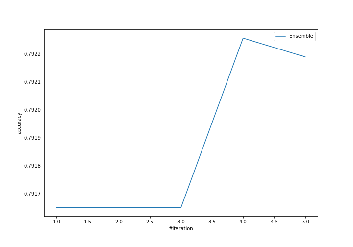
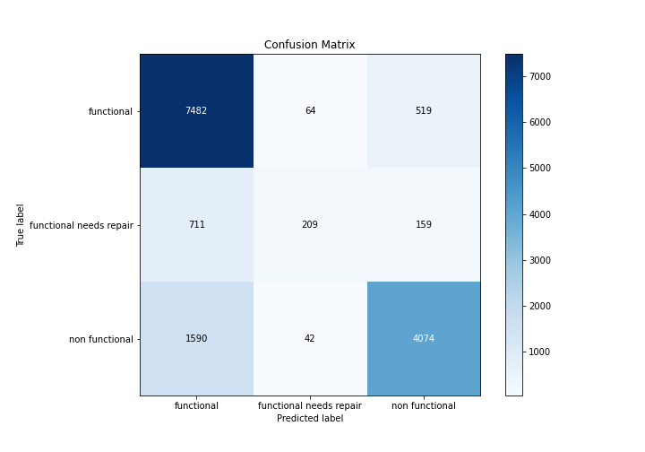
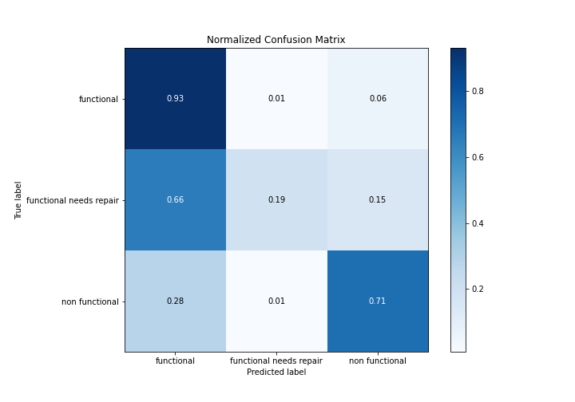
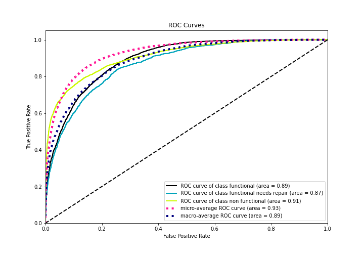
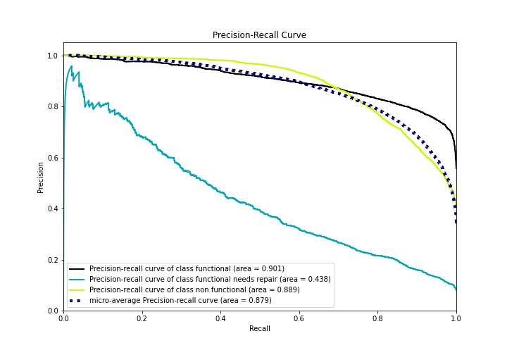

# Summary of Ensemble

[<< Go back](../README.md)

## Ensemble structure
| Model                   |   Weight |
|:------------------------|---------:|
| 3_Default_Xgboost       |        3 |
| 4_Default_NeuralNetwork |        1 |

### Metric details
|           |   functional |   functional needs repair |   non functional |   accuracy |    macro avg |   weighted avg |   logloss |
|:----------|-------------:|--------------------------:|-----------------:|-----------:|-------------:|---------------:|----------:|
| precision |     0.764796 |                  0.663492 |         0.857323 |   0.792256 |     0.76187  |       0.792988 |  0.508902 |
| recall    |     0.927712 |                  0.193698 |         0.713985 |   0.792256 |     0.611798 |       0.792256 |  0.508902 |
| f1-score  |     0.838413 |                  0.299857 |         0.779116 |   0.792256 |     0.639129 |       0.776497 |  0.508902 |
| support   |  8065        |               1079        |      5706        |   0.792256 | 14850        |   14850        |  0.508902 |

## Confusion matrix
|                                    |   Predicted as functional |   Predicted as functional needs repair |   Predicted as non functional |
|:-----------------------------------|--------------------------:|---------------------------------------:|------------------------------:|
| Labeled as functional              |                      7482 |                                     64 |                           519 |
| Labeled as functional needs repair |                       711 |                                    209 |                           159 |
| Labeled as non functional          |                      1590 |                                     42 |                          4074 |

## Learning curves

## Confusion Matrix

## Normalized Confusion Matrix

## ROC Curve

## Precision Recall Curve

[<< Go back](../README.md)
